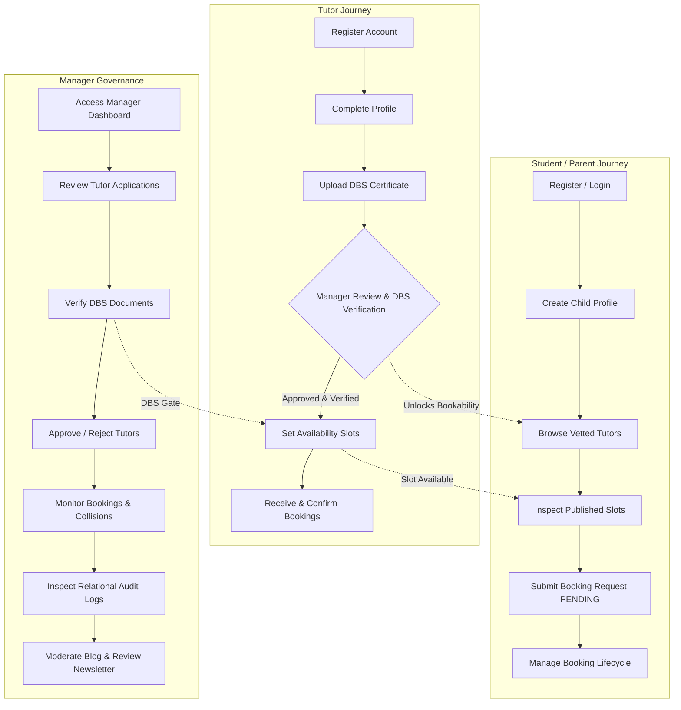
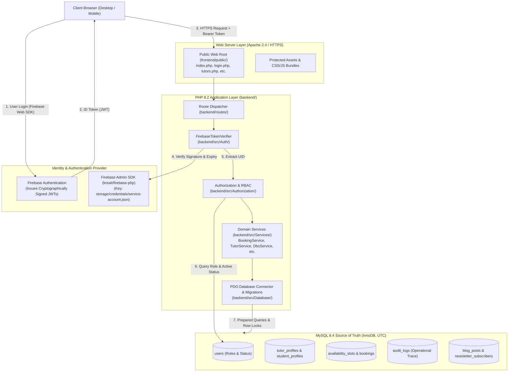
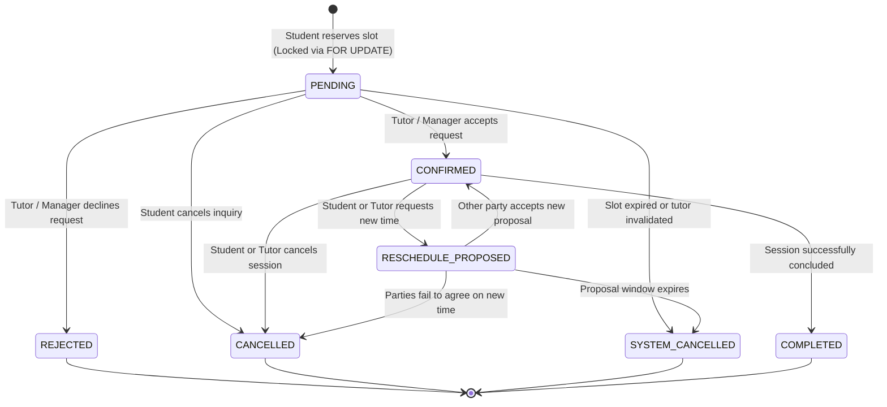
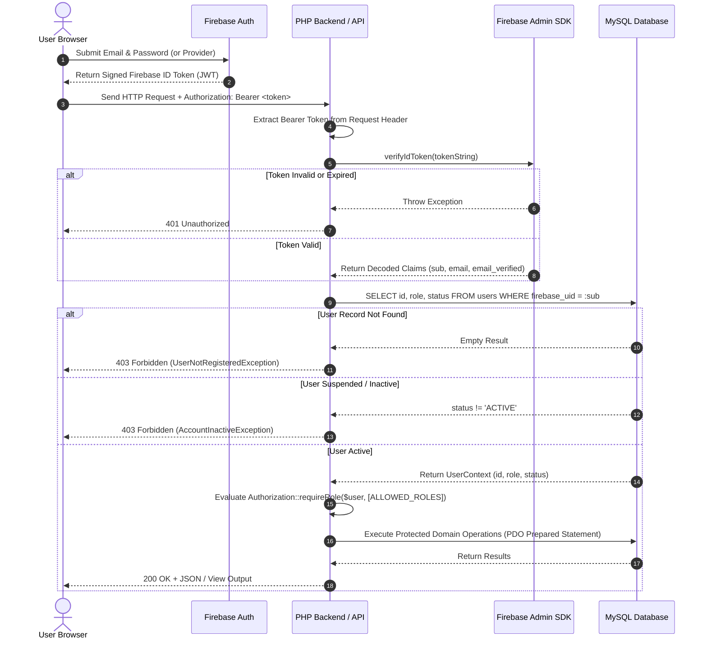
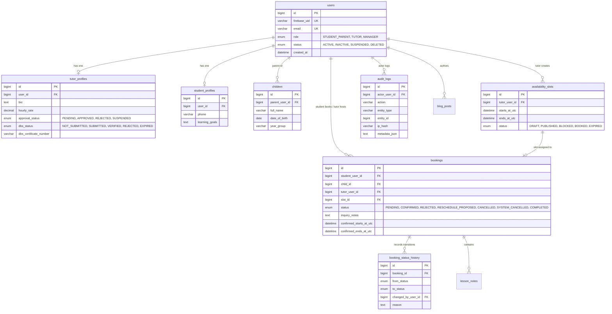

# AppTutors — UK Tutoring Platform

[](https://www.php.net/)
[](https://www.mysql.com/)
[](https://firebase.google.com/)
[](https://getcomposer.org/)
[](https://httpd.apache.org/)
[](#testing--quality-assurance)
[](#license)

> A role-based UK tutoring platform engineered with **PHP 8.2**, **MySQL 8.4**, and **Firebase Authentication**. Built to support secure tutor onboarding, safeguarding through Enhanced Disclosure and Barring Service (DBS) verification workflows, availability scheduling, student/parent lesson booking, administrative governance, blog publishing, and newsletter management.

<p align="center">
  <a href="https://github.com/dinesh37518">
    
  </a><br/>
  <b>Author:</b> <a href="https://github.com/dinesh37518">Dineshkumar M</a> (<code>@dinesh37518</code>)<br/>
  <b>Repository:</b> <a href="https://github.com/dinesh37518/AppiTutors">https://github.com/dinesh37518/AppiTutors</a>
</p>

---

## Table of Contents

- [Project Status](#project-status)
- [Problem Statement](#problem-statement)
- [Solution Overview](#solution-overview)
- [System Architecture](#system-architecture)
- [User Roles & Authorization](#user-roles--authorization)
- [Key Features](#key-features)
- [Booking Workflow & State Machine](#booking-workflow--state-machine)
- [Authentication Flow](#authentication-flow)
- [Database Architecture](#database-architecture)
- [Operational Audit Logging](#operational-audit-logging)
- [Security & Safeguarding Controls](#security--safeguarding-controls)
- [Technology Stack](#technology-stack)
- [Project Directory Structure](#project-directory-structure)
- [Implemented API Endpoints](#implemented-api-endpoints)
- [Local Environment Setup](#local-environment-setup)
- [Firebase Setup](#firebase-setup)
- [Database Setup & Migrations](#database-setup--migrations)
- [Testing & Quality Assurance](#testing--quality-assurance)
- [Frontend Design Status](#frontend-design-status)
- [Open Client Decisions & Scope Boundaries](#open-client-decisions--scope-boundaries)
- [Project Roadmap](#project-roadmap)
- [Author & Maintainer](#author--maintainer)
- [License](#license)

---

## Project Status

The project has completed its baseline architecture, core domain implementations, security hardening, and cumulative QA/UAT regression testing on the local development environment.

| Subsystem / Area | Status | Verified Implementation Details |
| :--- | :---: | :--- |
| **Development Environment** | Verified | Local Windows 11, Apache 2.4.58, PHP 8.2.12, MySQL 8.4.9 (Strict Mode, InnoDB, UTC) |
| **Architecture & Foundation** | Verified | 12-phase modular architecture, PSR-4 autoloading, centralized configuration |
| **Database & Migrations** | Verified | 11 domain tables + `migrations` tracking table; InnoDB engine, foreign keys, UTF-8 (`utf8mb4`) |
| **Firebase Admin SDK** | Verified | Server-side token verifier via `kreait/firebase-php` with credentials isolated in `storage/` |
| **Authentication & RBAC** | Verified | ID token verification, Firebase UID mapping to MySQL `users`, strict server-side role authority |
| **Tutor Safeguarding & DBS** | Verified | Multi-state tutor approval, private DBS document upload (`storage/private/dbs/`), manager verification gate |
| **Student / Parent Portal** | Verified | Profile management, child account creation, IDOR-protected child ownership validation |
| **Booking Engine** | Verified | 7 discrete master booking states, slot calculations, pessimistic concurrency protection (`FOR UPDATE`) |
| **Email Abstraction** | Verified | Multi-transport `EmailService` (Log, Array, Null, SMTP adapters) with transactional templates |
| **Manager Administration** | Verified | Administrative dashboard, tutor review, DBS verification, child linking, audit viewer, reporting |
| **Blog & Newsletter** | Verified | Editorial authoring lifecycle (draft, submit, approve, publish), newsletter subscription & suppression |
| **Security Controls** | Verified | CSRF protection, rate limiting, security headers, XSS escaping, DSAR export & account scrubbing |
| **Automated Tests** | Verified | **500 / 500 tests passed** (100% cumulative pass rate across Unit, Integration, Security, and UAT) |
| **Frontend Styling** | Functional | Responsive, functional UI; design taste visual polish scheduled as a subsequent refinement pass |
| **Cloud Deployment** | Not Started | Scope is currently local development and verification; zero cloud/hosting infrastructure provisioned |

---

## Problem Statement

Private tutoring platforms in the United Kingdom face distinct regulatory, safeguarding, and architectural challenges:

1. **Safeguarding & Compliance:** Safeguarding standards require rigorous vetting of tutors working with children. Platforms cannot allow unverified tutors to interact with students or publish public schedules without strict Disclosure and Barring Service (DBS) verification and administrative review.
2. **Scheduling Collisions & Concurrency:** Real-time scheduling across independent student and tutor calendars frequently leads to race conditions, double-bookings, and inconsistent calendar states without pessimistic transaction locking.
3. **Multi-Role Governance:** Educational ecosystems involve distinct actors with varying authority: parents managing bookings on behalf of young dependents, adult students managing their own studies, tutors setting availability, and managers overseeing compliance. Client-side role claims cannot be trusted.
4. **Auditability & Privacy:** Safeguarding audits demand transparent, durable records of managerial actions, profile approvals, and status transitions, while UK GDPR necessitates engineering hooks for Data Subject Access Requests (DSAR) and account minimization.

---

## Solution Overview

AppTutors resolves these challenges by separating identity verification (delegated to Firebase) from application state, permissions, and domain business rules (anchored strictly in a MySQL relational database).



---

## System Architecture

The architecture enforces a strict boundary between public presentation, application routing, identity verification, and relational persistence.



### Architectural Principles

1. **Identity vs. Authority:** Firebase Authentication serves solely as the identity provider. It authenticates credentials and signs ID tokens. Firebase does **not** store application business roles, student profiles, or booking records.
2. **MySQL as the Source of Truth:** The MySQL database (`tutoring_platform_dev`) stores all domain entities, profile attributes, availability schedules, and user roles (`STUDENT_PARENT`, `TUTOR`, `MANAGER`).
3. **Zero Client Role Trust:** The browser never dictates or transmits user roles. The backend resolves the authenticated Firebase UID against `users.firebase_uid` in MySQL, deriving user authority server-side.
4. **Isolation of Credentials:** Private service-account keys and encrypted documents reside strictly in `storage/` outside the web server's document root, blocked by `.gitignore`.

---

## User Roles & Authorization

The platform enforces three distinct user roles governed strictly by server-side checks (`App\Authorization\Authorization`):

| Role Identifier | System Responsibilities & Boundaries |
| :--- | :--- |
| **`STUDENT_PARENT`** | • Discovers approved and verified tutors via the directory.<br/>• Creates and manages linked child profiles (`children` table).<br/>• Reserves published availability slots creating `PENDING` bookings.<br/>• Cancels or proposes rescheduling for their own bookings.<br/>• Submits Data Subject Access Requests (DSAR) or account erasure requests.<br/>• Strictly prohibited from accessing tutor backend controls or manager dashboards. |
| **`TUTOR`** | • Completes subject specialisms, bio, hourly rate, and qualifications.<br/>• Uploads Enhanced DBS certificate and documentation to secure storage.<br/>• Once approved and verified, creates and manages discrete availability slots.<br/>• Accepts, rejects, or completes student booking requests.<br/>• Authors educational blog posts in `DRAFT` status and submits them for review.<br/>• Unbookable by students until status is `ACTIVE + APPROVED + VERIFIED`. |
| **`MANAGER`** | • Oversees system governance, platform metrics, and administrative reporting.<br/>• Inspects and verifies confidential tutor DBS documents.<br/>• Grants or denies tutor platform approval (`APPROVED`, `REJECTED`, `SUSPENDED`).<br/>• Moderates, approves, publishes, or archives educational blog posts.<br/>• Manages newsletter subscriber lists and enforces suppression compliance.<br/>• Inspects system-wide relational audit logs.<br/>• Provisioned exclusively via secure CLI tooling (`bin/create_manager.php`); self-registration is strictly blocked. |

---

## Key Features

### 1. Authentication & Identity
* **Firebase Token Verification:** Cryptographic signature, issuer, and expiration verification via `Kreait\Firebase\Contract\Auth`.
* **Database User Resolution:** Automated lookup mapping `firebase_uid` to MySQL primary key `users.id`.
* **Self-Escalation Defense:** Server-side guard (`assertCannotSelfAssignManager`) prevents users from assigning themselves elevated permissions during registration.
* **Account Status Enforcement:** Immediate rejection of requests originating from `SUSPENDED`, `INACTIVE`, or `DELETED` accounts.

### 2. Tutor Onboarding & Safeguarding
* **Three-Part Bookability Gate:** Tutors become bookable if and only if:
  $$\text{User Status} = \text{ACTIVE} \quad \land \quad \text{Approval Status} = \text{APPROVED} \quad \land \quad \text{DBS Status} = \text{VERIFIED}$$
* **Protected DBS Uploads:** Files (PDF, PNG, JPEG up to 5MB) are stored in `storage/private/dbs/` outside public web access.
* **Confidential Access Boundaries:** Only authorized Managers can view or download raw DBS certificates; direct student, parent, or cross-tutor access is rejected with `403 Forbidden`.

### 3. Student & Parent Portal
* **Parent-Child Account Linking:** Single-parent account model enabling parents to create child profiles for targeted tutoring.
* **Horizontal IDOR Protection:** Ownership validation ensures users can only view, edit, or book sessions for children registered under their own account ID.
* **Tutor Discovery:** Search directory filtering exclusively verified, approved, and active tutors.

### 4. Booking & Scheduling Engine
* **Discrete Availability Slots:** Tutors publish concrete calendar slots in UTC with validation ensuring `ends_at_utc > starts_at_utc`.
* **Overlap Prevention:** Database-level constraint checking blocks tutors from publishing overlapping availability windows.
* **Pessimistic Concurrency Locking:** Exclusive row locks (`SELECT ... FOR UPDATE`) during booking creation eliminate race conditions and double-booking bugs.

### 5. Manager Administration
* **Centralized KPI Dashboard:** Real-time metrics tracking active tutors, pending approvals, total bookings, and recent audit events.
* **Tutor Vetting Interface:** Single-pane review of applicant qualifications, DBS numbers, and uploaded documentation.
* **Administrative Audit Logs:** Comprehensive event stream capturing managerial decisions, status modifications, and auth failures.

### 6. Content & Communication
* **Blog Editorial Lifecycle:** Multi-stage workflow (`DRAFT` $\rightarrow$ `SUBMITTED` $\rightarrow$ `APPROVED` $\rightarrow$ `PUBLISHED` $\rightarrow$ `ARCHIVED`) preventing self-publishing by tutors.
* **Newsletter Engine:** Double opt-in compliant architecture with explicit consent recording and unsubscribe suppression handling.
* **Email Abstraction:** Decoupled `EmailService` utilizing template views (`backend/src/Views/emails/`) and swappable mailer adapters.

---

## Booking Workflow & State Machine

The platform adheres to exactly **seven approved booking states**. The invalid state `RESCHEDULED` does not exist in code or database schema; rescheduling flows through `RESCHEDULE_PROPOSED`.



### Concurrency Protection Mechanism
When a student initiates a booking request against an availability slot:
1. A MySQL transaction begins (`$pdo->beginTransaction()`).
2. The slot is fetched with an exclusive lock:
   ```sql
   SELECT id, tutor_user_id, starts_at_utc, ends_at_utc, status 
   FROM `availability_slots` 
   WHERE id = :slot_id 
   FOR UPDATE;
   ```
3. The engine verifies the slot is in `PUBLISHED` status and starts in the future.
4. Concurrently competing requests block at the database engine until the active transaction commits or rolls back, guaranteeing zero double-bookings.

---

## Authentication Flow

The following sequence details how an incoming API or page request is authenticated and authorized:



---

## Database Architecture

The relational schema is implemented in **MySQL 8.4** utilizing the **InnoDB** storage engine, `utf8mb4_unicode_ci` encoding, strict foreign key constraints, and standard **UTC timestamps**.



### Complete Table Manifest

| Table Name | Classification | Primary Purpose & Structural Constraints |
| :--- | :--- | :--- |
| **`migrations`** | Infrastructure | Tracks sequential schema version execution (`migration`, `batch`, `executed_at`). |
| **`users`** | Identity / Auth | Primary user ledger linking `firebase_uid`, email, application `role`, and account `status`. |
| **`tutor_profiles`** | Domain Entity | Stores tutor qualifications, hourly rate, DBS certificate details, and managerial approval status. |
| **`student_profiles`**| Domain Entity | Profile data for adult students and account-holding parents. |
| **`children`** | Safeguarding / Family | Child records linked to a parent with date of birth and academic year group. |
| **`availability_slots`**| Scheduling | Tutor calendar slots in UTC with `ends_at_utc > starts_at_utc` check constraint. |
| **`bookings`** | Transactions | Core lesson requests across the 7 master booking states with foreign keys to slots and actors. |
| **`booking_status_history`** | Operational Audit | Historical log tracking every state transition, actor ID, and optional transition reason. |
| **`lesson_notes`** | Academic Record | Session summaries and pedagogical feedback recorded following lesson completion. |
| **`audit_logs`** | Security Audit | Relational audit trail capturing security-sensitive events, hashed IPs, and redacted metadata. |
| **`newsletter_subscribers`** | Communication | Email subscriber list tracking opt-in confirmation timestamps and suppression status. |
| **`blog_posts`** | Editorial Content | Educational articles moving through draft, review, approved, published, and archived states. |

---

## Operational Audit Logging

The platform maintains operational accountability via `App\Services\AuditService`, writing structured records to the MySQL `audit_logs` table.

### What is Recorded:
* **`actor_user_id`**: The authenticated database user ID performing the operation (or `NULL` for unauthenticated events).
* **`action`**: A descriptive event tag (e.g., `USER_REGISTERED`, `TUTOR_APPROVED`, `DBS_VERIFIED`, `BOOKING_CREATED`, `ROLE_CHECK_FAILED`).
* **`entity_type` & `entity_id`**: The domain entity affected (e.g., `user`, `booking`, `tutor_profile`).
* **`ip_hash`**: The SHA-256 cryptographic hash of the client IP address (enabling duplicate detection without storing raw IP addresses in plain text).
* **`user_agent`**: Truncated client user-agent string (maximum 500 characters).
* **`metadata_json`**: Contextual attributes automatically scrubbed of sensitive fields (passwords, tokens, certificate secrets) via `Logger::redactSensitiveData()`.
* **`created_at`**: UTC timestamp generated by MySQL `UTC_TIMESTAMP()`.

> **Note on Immutability:** Audit records are persisted within standard MySQL InnoDB tables. They are not stored on an append-only hardware ledger or blockchain; operational database administrators possess physical access to the table.

---

## Security & Safeguarding Controls

The platform implements layered technical controls designed to enforce secure authentication, authorization, data integrity, and privacy:

* **Server-Side Role Authority:** Client applications cannot assign roles or tamper with permissions. Roles are queried directly from MySQL upon every authenticated request.
* **Object-Level Authorization (IDOR Defense):** Fine-grained checks (`assertOwnership`) ensure users cannot access, modify, or delete resources (children, bookings, profiles) belonging to other users.
* **SQL Injection Prevention:** 100% of database interactions are executed through PDO prepared statements with bound parameters; zero dynamic SQL concatenation.
* **Cross-Site Scripting (XSS) Defense:** All view outputs are sanitized through `App\Support\View::e()` using `htmlspecialchars(..., ENT_QUOTES | ENT_SUBSTITUTE, 'UTF-8')`.
* **Cross-Site Request Forgery (CSRF):** Form submissions validate cryptographic per-session tokens via `App\Support\Csrf`.
* **Security Headers Applied:** Responses emit `X-Content-Type-Options: nosniff`, `X-Frame-Options: SAMEORIGIN`, and strict `Content-Security-Policy` with `object-src 'none'` and disallowing `'unsafe-eval'`.
* **Rate Limiting:** File-backed IP rate limiter (`App\Support\RateLimiter`) throttles repetitive or abusive requests to public API endpoints.
* **Data Privacy (UK GDPR Technical Hooks):**
  * **DSAR Export:** `PrivacyService::generateDsarExport()` compiles a full JSON archive of a user's account, profile, bookings, and children.
  * **Account Anonymization:** `PrivacyService::requestAccountErasure()` obfuscates personal identifiers (`erased_{id}_{hash}@anonymized.invalid`, names scrubbed) while preserving necessary safeguarding audit history.
  * **Erasure Deferral:** Erasure is automatically deferred if active or confirmed bookings exist.

> *Disclaimer:* Technical controls are provided to support security, privacy, and compliance workflows. They do not constitute formal legal certification under UK GDPR or WCAG regulations.

---

## Technology Stack

| Component | Technology | Version / Spec | Purpose in System |
| :--- | :--- | :--- | :--- |
| **Backend Runtime** | PHP | 8.2+ | Primary server-side programming language and business logic |
| **Database Engine** | MySQL | 8.4+ (InnoDB) | Relational source of truth, foreign keys, transaction row locks |
| **Identity Provider** | Firebase Authentication | Client Web SDK v10+ | User registration, credential verification, JWT issuance |
| **Admin SDK** | `kreait/firebase-php` | ^7.14 | Server-side cryptographic token verification |
| **Database Access** | PHP PDO | PHP Core Extension | Type-safe prepared statements and transactional rollbacks |
| **Package Manager** | Composer | 2.x | PHP dependency management and PSR-4 class autoloading |
| **Local Web Server** | Apache HTTP Server | 2.4 | Local virtual host routing requests to `frontend/public/` |
| **Frontend Styling** | Vanilla CSS / Utilities | CSS3 / Responsive | Design tokens, custom properties, responsive layout grids |
| **Frontend Runtime** | Vanilla JavaScript | ES6+ Standard | Client-side DOM interaction, modal dialogs, fetch calls |
| **Version Control** | Git | 2.x | Distributed source code version management |

---

## Project Directory Structure

```text
Client Apptutors/
├── .agents/                      # Agent configurations and skill definitions
│   └── skills/
│       └── design-taste-frontend/ # Visual design skill (scheduled for subsequent pass)
├── backend/                      # Core PHP application logic
│   ├── api/                      # REST API endpoint handlers
│   │   ├── dbs/                  # Tutor DBS upload & document endpoints
│   │   ├── manager/              # Manager administration endpoints
│   │   ├── newsletter/           # Newsletter subscription & unsubscribe endpoints
│   │   ├── parent/               # Parent child-management endpoints
│   │   ├── register/             # Registration endpoints (tutor, student)
│   │   └── student/              # Student profile endpoints
│   ├── bootstrap/                # Application initialization (bootstrap.php, app.php)
│   ├── config/                   # Configuration files (app, database, firebase, mail)
│   ├── routes/                   # Route maps (api.php, web.php)
│   ├── src/                      # PSR-4 namespaced source code (App\)
│   │   ├── Auth/                 # Firebase token verifier, user context, exceptions
│   │   ├── Authorization/        # RBAC and IDOR ownership assertions
│   │   ├── Database/             # Database connection manager and migration runner
│   │   ├── Logging/              # PSR-compliant logging with data redaction
│   │   ├── Services/             # Domain services (Booking, Tutor, Dbs, Email, etc.)
│   │   ├── Support/              # Utility helpers (CSRF, RateLimiter, View, Env, Timezone)
│   │   ├── Validation/           # Input validation rules and exception classes
│   │   └── Views/emails/         # Transactional email notification templates
│   └── README.md
├── bin/                          # CLI administrative scripts
│   └── create_manager.php        # Secure CLI tool to provision manager accounts
├── database/                     # MySQL database resources
│   ├── migrations/               # Sequential SQL schema migrations (001 to 006)
│   ├── scripts/                  # CLI database migration and management scripts
│   ├── seeds/                    # Seed datasets (educational blog seeder)
│   ├── migrate.php               # Standalone database migration runner
│   └── README.md
├── docs/                         # Specifications, architecture, and phase completion reports
│   ├── PHASE-01-DISCOVERY.md     # Discovery specifications
│   ├── PHASE-02-ARCHITECTURE.md  # Architectural blueprints
│   ├── PHASE-03-FOUNDATION.md    # Foundation report
│   ├── PHASE-12-QA-UAT-PLAN.md   # QA/UAT test plan
│   └── PHASE-12-QA-UAT-REPORT.md # Cumulative 500-test verification report
├── firebase/                     # Firebase integration documentation and assets
├── frontend/                     # Presentation layer
│   ├── public/                   # Public document root
│   │   ├── assets/               # CSS styles (app.css) and client scripts (app.js)
│   │   ├── .htaccess             # Apache rewrite rules and security directives
│   │   ├── index.php             # Main website entry point
│   │   ├── tutors.php            # Tutor directory
│   │   ├── book-session.php      # Lesson booking interface
│   │   └── manager-*.php         # Manager administration portal screens
│   ├── views/                    # Reusable view templates (header, footer, auth, layouts)
│   └── README.md
├── storage/                      # Runtime-generated data (strictly outside web root)
│   ├── cache/                    # Runtime application caches (.gitkeep)
│   ├── credentials/              # Private service-account keys (Git-ignored)
│   ├── logs/                     # Application error and audit log files (.gitkeep)
│   ├── private/                  # Encrypted DBS uploads (storage/private/dbs/)
│   └── uploads/                  # Protected user file uploads (.gitkeep)
├── tests/                        # Comprehensive test suite
│   ├── Integration/              # Component integration tests
│   ├── Security/                 # Authorization & security boundary tests
│   ├── UAT/                      # User acceptance scenario tests
│   ├── Unit/                     # Isolated unit tests
│   └── existing-phase-tests/     # Canonical phase test suites (Phases 3–12)
├── .env.example                  # Environment variable configuration template
├── .gitignore                    # Git privacy and secret exclusion rules
├── .hintrc                       # Web hinting and linter configuration
├── composer.json                 # Composer dependencies and PSR-4 definitions
├── composer.lock                 # Locked dependency version manifest
├── preflight_check.php           # Local environment diagnostic verification utility
└── README.md                     # Root project documentation
```

---

## Implemented API Endpoints

All application API endpoints reside under `backend/api/` and output standard JSON responses:

| Endpoint Path | Method | Allowed Roles | Description |
| :--- | :---: | :---: | :--- |
| **`/backend/api/health.php`** | `GET` | Public | System health check (database ping, UTC time verification). |
| **`/backend/api/auth.php`** | `POST` | Authenticated | Resolves Firebase token and returns user context and role. |
| **`/backend/api/register/tutor.php`** | `POST` | Authenticated | Registers an unverified tutor profile linked to the Firebase UID. |
| **`/backend/api/register/student.php`**| `POST` | Authenticated | Registers a student/parent profile linked to the Firebase UID. |
| **`/backend/api/tutors.php`** | `GET` | Public | Lists active, approved, and verified tutors for the directory. |
| **`/backend/api/availability.php`** | `GET, POST` | `TUTOR`, `MANAGER` | Fetches or publishes discrete availability slots. |
| **`/backend/api/bookings.php`** | `GET, POST, PATCH`| Authenticated | Queries booking history, creates requests, or updates status. |
| **`/backend/api/dbs/upload.php`** | `POST` | `TUTOR`, `MANAGER` | Uploads an Enhanced DBS certificate file to private storage. |
| **`/backend/api/dbs/document.php`** | `GET` | `MANAGER` | Securely streams a stored raw DBS document to authorized managers. |
| **`/backend/api/parent/children.php`** | `GET, POST` | `STUDENT_PARENT` | Manages child profiles associated with the parent account. |
| **`/backend/api/student/profile.php`** | `GET, PUT` | `STUDENT_PARENT` | Retrieves or updates student profile data. |
| **`/backend/api/blog.php`** | `GET, POST` | Public / `TUTOR` | Retrieves published blog articles or submits new drafts. |
| **`/backend/api/newsletter/subscribe.php`**| `POST` | Public | Registers a new newsletter subscription with consent check. |
| **`/backend/api/newsletter/unsubscribe.php`**| `GET, POST` | Public | Processes subscriber token unsubscribe requests. |
| **`/backend/api/privacy.php`** | `GET, POST` | Authenticated | Handles DSAR JSON export and account anonymization requests. |
| **`/backend/api/manager/dashboard.php`** | `GET` | `MANAGER` | Provides administrative aggregate KPIs and statistics. |
| **`/backend/api/manager/tutors.php`** | `GET, PATCH`| `MANAGER` | Lists applicants and updates tutor approval status. |
| **`/backend/api/manager/dbs.php`** | `PATCH` | `MANAGER` | Updates tutor DBS status (`VERIFIED`, `REJECTED`, etc.). |
| **`/backend/api/manager/audit.php`** | `GET` | `MANAGER` | Paginates through operational audit logs. |
| **`/backend/api/manager/reports.php`** | `GET` | `MANAGER` | Generates summary reports across bookings and tutors. |

---

## Local Environment Setup

### Prerequisites
* **Operating System:** Windows 10/11, macOS, or Linux.
* **PHP:** Version 8.2 or higher with required extensions: `pdo_mysql`, `curl`, `openssl`, `mbstring`, `json`.
* **MySQL Server:** Version 8.0 or 8.4 (configured with InnoDB support).
* **Dependency Manager:** [Composer](https://getcomposer.org/) 2.x.
* **Web Server:** Apache 2.4 (or PHP's built-in CLI development server for local testing).

### Installation Steps

1. **Clone the repository:**
   ```bash
   git clone https://github.com/dinesh37518/AppiTutors.git
   cd AppiTutors
   ```

2. **Install PHP dependencies:**
   ```bash
   composer install
   ```

3. **Configure Environment Variables:**
   Copy the example environment template to create your active `.env` file:
   ```bash
   cp .env.example .env
   ```
   Open `.env` in an editor and update your database credentials:
   ```env
   APP_NAME="UK Tutoring Platform"
   APP_ENV=local
   APP_DEBUG=true
   APP_URL=http://localhost:8080
   APP_TIMEZONE=Europe/London

   DB_CONNECTION=mysql
   DB_HOST=127.0.0.1
   DB_PORT=3306
   DB_DATABASE=tutoring_platform_dev
   DB_USERNAME=root
   DB_PASSWORD=your_mysql_password
   DB_TIMEZONE="+00:00"

   FIREBASE_PROJECT_ID=your-firebase-project-id
   FIREBASE_CREDENTIALS_PATH=storage/credentials/firebase-service-account.json

   EMAIL_MAILER=log
   ```

4. **Execute Preflight Environment Diagnostic:**
   Verify your PHP extensions, directories, and write permissions:
   ```bash
   php preflight_check.php
   ```

---

## Firebase Setup

Firebase Authentication handles user identity and token issuance. Follow these steps to configure the integration safely:

1. Create a project in the [Firebase Console](https://console.firebase.google.com/).
2. Navigate to **Authentication** > **Sign-in method** and enable **Email/Password**.
3. Navigate to **Project Settings** > **Service accounts**.
4. Click **Generate new private key** to download your service-account JSON file.
5. Place the downloaded JSON file into the project credentials directory:
   ```text
   storage/credentials/firebase-service-account.json
   ```
   *(This path is strictly excluded from version control in `.gitignore`)*.
6. Verify your `.env` contains the corresponding path and project ID:
   ```env
   FIREBASE_PROJECT_ID=your-actual-firebase-project-id
   FIREBASE_CREDENTIALS_PATH=storage/credentials/firebase-service-account.json
   ```

---

## Database Setup & Migrations

1. **Execute the Migration Runner:**
   The automated migration tool creates the database (if absent), initializes the `migrations` tracking table, and runs migrations `001` through `006`:
   ```bash
   php database/migrate.php
   ```

2. **Seed Initial Editorial Blog Content (Optional):**
   ```bash
   php database/seed_editorial_blog.php
   ```

3. **Provision an Administrative Manager Account:**
   Because manager self-registration is strictly blocked through the web interface, execute the CLI tool to create an initial manager:
   ```bash
   php bin/create_manager.php
   ```
   Provide the Firebase UID, email address, and display name when prompted.

4. **Start Local Development Server:**
   ```bash
   php -S 127.0.0.1:8080 -t frontend/public
   ```
   Visit `http://127.0.0.1:8080` in your web browser.

---

## Testing & Quality Assurance

The platform features an automated test suite executed during Phase 12 verification with a **100% pass rate**:

$$\mathbf{500 \text{ of } 500 \text{ Tests Passed (100.0\%)}}$$

### Test Domain Breakdown

| Test Suite / Phase | Scope & Assertions Tested | Test Count | Pass Rate |
| :--- | :--- | :---: | :---: |
| **Phase 3 (Foundation)** | Config loading, PDO connectivity, migrations, UTC timezone enforcement | 25 | 100% |
| **Phase 4 (Public Website)** | Public routing, HTTP 200/404 handling, asset integrity, WCAG semantic markup | 30 | 100% |
| **Phase 5 (Tutor Workflow)** | Tutor registration, bookability gates, DBS submission, slot validation | 51 | 100% |
| **Phase 6 (Student / Parent)** | Student registration, child account creation, horizontal IDOR protection | 45 | 100% |
| **Phase 7 (Booking Engine)** | 7 master states, slot reservations, double-booking prevention, transitions | 40 | 100% |
| **Phase 8 (Email Integration)** | Provider-agnostic dispatch, HTML/plain-text templates, transaction decoupling | 33 | 100% |
| **Phase 9 (Manager Admin)** | KPI metrics, tutor approval workflow, DBS document inspection, reporting | 39 | 100% |
| **Phase 10 (Blog & Newsletter)**| Editorial lifecycle (draft to publish), double opt-in, suppression compliance | 83 | 100% |
| **Phase 11 (Security & Privacy)**| SQL injection defense, XSS escaping, CSRF tokens, DSAR export, account scrubbing | 78 | 100% |
| **Phase 12 (QA / UAT Scenarios)**| End-to-end multi-actor scenarios, concurrent InnoDB row-locking verification | 76 | 100% |
| **Total Platform Baseline** | **Comprehensive Regression Suite** | **500** | **100.0%** |

### Executing the Test Suite
Ensure MySQL is running with test database access, then run:
```bash
php tests/existing-phase-tests/run_tests.php
```

> **Note on Mocking:** Automated unit and integration tests utilize isolated local test databases and mocked Firebase token responses. They verify internal logic without requiring live network calls to third-party commercial services.

---

## Frontend Design Status

* **Functional State:** The current user interface in `frontend/public/` is fully functional, accessible, and responsive across desktop, tablet, and mobile viewports.
* **Taste Skill Refinement:** A dedicated visual polish and design refinement pass using the frontend taste skill is planned as a subsequent stage. This aesthetic refinement is intentionally isolated to presentation styling and will not alter database schemas, authorization guards, or backend business logic.

---

## Open Client Decisions & Scope Boundaries

To maintain software integrity without making unauthorized business assumptions, eleven (11) policy items are implemented through neutral technical hooks and remain open for client commercial decision:

| # | Topic Area | Implemented Neutral Behavior | Status / Open Client Decision |
| :-: | :--- | :--- | :--- |
| **1** | **Double Opt-In Workflow** | Subscribers are recorded in neutral `PENDING` status. Administrative bypass is blocked. | `Open Decision` — Client to determine whether double opt-in confirmation email is required. |
| **2** | **Email Provider** | Decoupled via `EmailService` abstraction supporting Log, SMTP, Array, and Null drivers. | `Open Decision` — Selection of commercial email service (e.g., SendGrid, Mailgun, AWS SES, Postmark). |
| **3** | **Payment Gateway** | Zero commercial payment code exists. Lesson rates are displayed as numeric fields. | `Open Decision` — Selection of payment processing vendor (e.g., Stripe, GoCardless) and escrow rules. |
| **4** | **Cancellation Policy** | Technical capability to cancel is implemented for students, tutors, and managers. | `Open Decision` — Commercial terms, refund windows, and late-cancellation fee policies. |
| **5** | **Rescheduling Policy** | State machine supports `RESCHEDULE_PROPOSED`. The invalid state `RESCHEDULED` is omitted. | `Open Decision` — Allowed frequency of rescheduling requests and proposal expiration windows. |
| **6** | **Delivery Mode** | Data structures support neutral delivery attributes. | `Open Decision` — Policy regarding online tuition links (Zoom/Teams) vs in-person address verification. |
| **7** | **Lesson Note Visibility** | Notes table (`lesson_notes`) links to bookings with author tracking. | `Open Decision` — Rules specifying whether lesson notes are visible to parents or restricted to tutors. |
| **8** | **Recurring Availability** | Discrete slot scheduling is fully supported. | `Future Scope` — Automated recurring weekly availability patterns deferred to future release. |
| **9** | **Multi-Guardian Access** | Child records link to a single parent account. | `Future Scope` — Shared custody or multi-parent access models deferred to future iteration. |
| **10**| **DBS Retention Schedule** | Documents stored in secure private directory. | `Open Decision` — Legal data retention policy specifying when physical DBS certificate copies must be purged. |
| **11**| **Tutor Self-Publishing** | Bookability is governed by server approval (`ACTIVE + APPROVED + VERIFIED`). | `Open Decision` — Determining whether approved tutors have an independent toggle to hide their profiles temporarily. |

---

## Project Roadmap

- [x] **Phase 1: Discovery & Specification** — Requirements gathering and domain model mapping.
- [x] **Phase 2: Architecture & System Design** — Identity vs authority decoupling and data model definition.
- [x] **Phase 3: Foundation & Core Backend** — Database migrations, configuration loaders, and error handling.
- [x] **Phase 4: Public Website & Navigation** — Public pages, responsive layout, and semantic markup.
- [x] **Phase 5: Tutor Workflow & Safeguarding** — Profile onboarding, DBS document upload, and approval gates.
- [x] **Phase 6: Student & Parent Portal** — Profile configuration, child account creation, and IDOR protection.
- [x] **Phase 7: Booking Engine** — Discrete availability slots, 7 master states, and pessimistic row locking.
- [x] **Phase 8: Email Notification Integration** — Multi-transport email abstraction and branded transactional templates.
- [x] **Phase 9: Manager Administration** — Administrative dashboard, DBS verification, audit logs, and reports.
- [x] **Phase 10: Educational Blog & Newsletter** — Content authoring lifecycle, double opt-in, and suppression.
- [x] **Phase 11: Security Hardening & GDPR** — CSRF guard, rate limiter, security headers, DSAR export, and erasure.
- [x] **Phase 12: Comprehensive QA / UAT** — Full regression pass (500/500 tests passed) and scenario validation.
- [ ] **End-to-End Live Firebase Cloud Verification** — Final staging verification with live client Firebase keys.
- [ ] **Frontend Visual Design Polish** — Aesthetic enhancements using the Taste Skill.
- [ ] **Client Commercial Policy Finalization** — Resolution of the 11 open client decisions.
- [ ] **Production Infrastructure & Deployment** — Staging/production server provisioning, SSL, and domain DNS setup.

---

## Author & Maintainer

<table>
  <tr>
    <td align="center">
      <a href="https://github.com/dinesh37518">
        <br />
        <sub><b>Dineshkumar M</b></sub>
      </a><br />
      <a href="https://github.com/dinesh37518"><code>@dinesh37518</code></a><br />
      <span>Lead Developer & Project Architect</span>
    </td>
  </tr>
</table>

- **GitHub Profile:** [@dinesh37518](https://github.com/dinesh37518)
- **Project Repository:** [AppiTutors](https://github.com/dinesh37518/AppiTutors)

---

## License

This project is proprietary software. All rights reserved. Unauthorized reproduction, duplication, or distribution of this code without explicit authorization is strictly prohibited.
