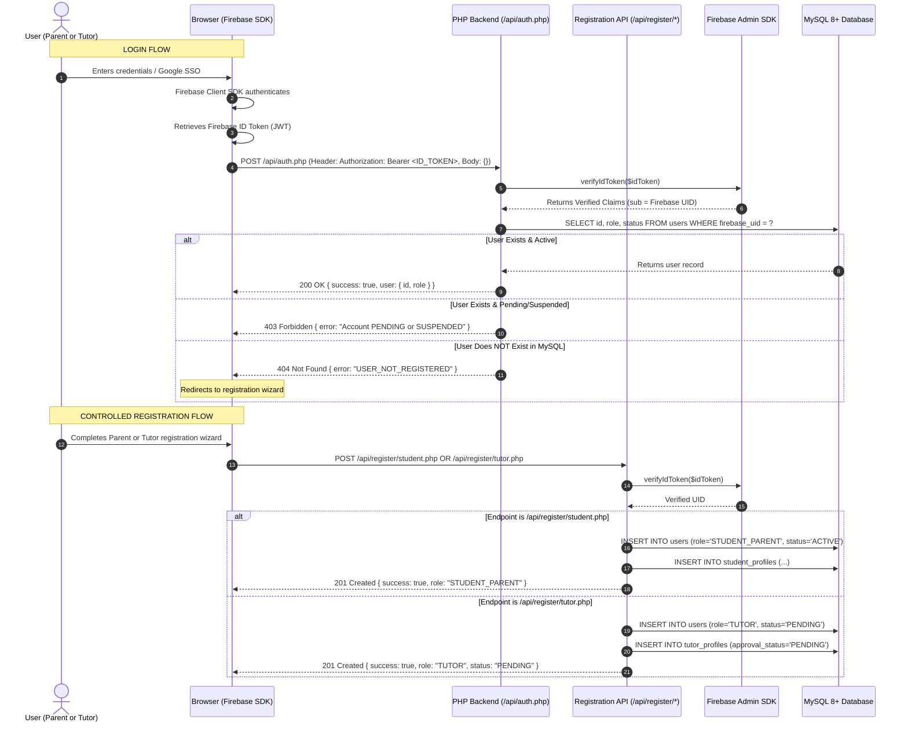
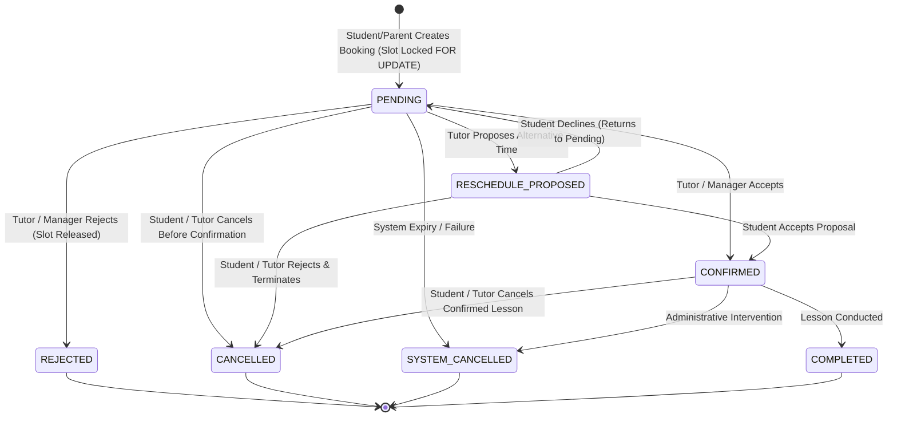
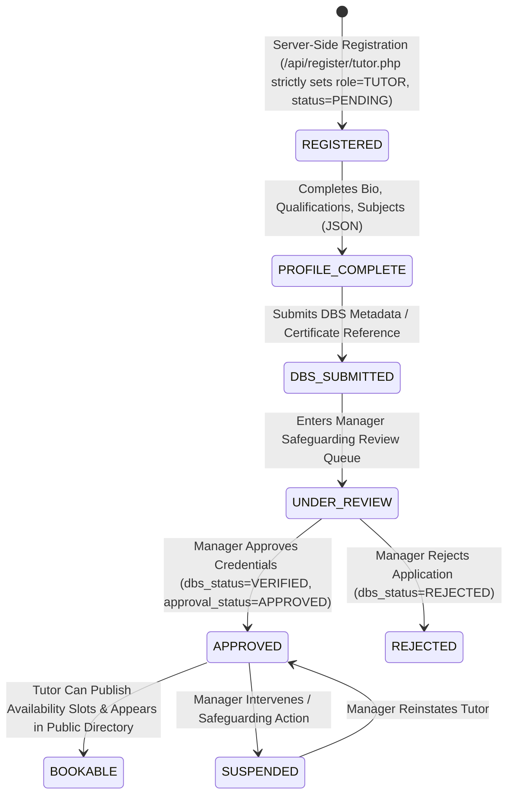

# PHASE 2 — SYSTEM ARCHITECTURE SPECIFICATION
## UK Tutoring Platform — Production Architecture Baseline
**Authoritative Baseline**: Production Master Project Document v2.0 | UK Tutoring Platform  
**Approved Discovery Baseline**: [docs/PHASE-01-DISCOVERY.md](file:///c:/Users/Dineshkumar%20M/OneDrive/Desktop/Client%20Apptutors/docs/PHASE-01-DISCOVERY.md)  
**Document ID**: `DOC-PHASE-02-ARCH`  
**Status**: APPROVED ARCHITECTURAL SPECIFICATION — BASELINE FOR PHASE 3+  
**Target Environment**: Local Windows Development (Apache/PHP 8.3 + Standalone MySQL 8.4 LTS) → Production Linux (Ubuntu LTS + Nginx/Apache + PHP 8.x + MySQL 8+)  

---

## 1. ARCHITECTURAL OVERVIEW & CORE TENETS

The UK Tutoring Platform architecture is structured around strict separation of concerns, zero client trust, and unambiguous boundaries between **identity verification** and **relational business authority**.

```
[ Web Browser / Client ]
       │
       │  HTTPS (TLS 1.3 / Strict-Transport-Security / Content-Security-Policy)
       ▼
[ Web Server: Apache / Nginx ]
       │  Directs /api to API Router, serves compiled assets from /public
       ▼
[ PHP 8.x Application Layer (REST API & Web Controllers) ]
       │
       ├── (1) Intercepts Request -> Extracts Authorization: Bearer <ID_TOKEN>
       ├── (2) Calls Firebase Admin SDK -> Cryptographically verifies JWT signature
       ├── (3) Extracts verified claims: sub (Firebase UID), email, email_verified
       │
       ▼
[ MySQL 8+ Database Layer (Application Source of Truth) ]
       ├── (4) Queries users WHERE firebase_uid = ?
       ├── (5) Resolves relational role: STUDENT_PARENT, TUTOR, MANAGER
       ├── (6) Checks user account status: ACTIVE vs PENDING / SUSPENDED
       ▼
[ Server-Side Authorization & IDOR Policy Engine ]
       ├── (7) Validates route role capability: requireRole($user, $allowedRoles)
       └── (8) Validates object ownership: $resource['owner_id'] === $user['id']
       ▼
[ Business Domain Execution (Services / PDO Transactions) ]
       ├── BookingService (Atomic FOR UPDATE row locking)
       ├── AvailabilityService (Timezone normalization UTC <-> Europe/London)
       ├── EmailService (Transactional notification dispatch abstraction)
       └── AuditService (Immutable audit log generation)
```

### 1.1 Separation of Responsibilities

| Subsystem | Core Responsibilities | What It Must NOT Do |
| :--- | :--- | :--- |
| **Firebase Authentication** | • Secure credential storage & authentication<br>• Password hashing (scrypt)<br>• Google SSO OAuth token exchange<br>• Issuance of signed short-lived JWT ID tokens (1 hour expiry)<br>• Password reset and email verification token flows | • Must NOT store application roles or permissions<br>• Must NOT store business data (no Firestore/RTDB)<br>• Must NOT make authorization decisions<br>• Must NOT act as application source of truth |
| **PHP 8.x Backend** | • Cryptographic verification of Firebase ID tokens via Firebase Admin SDK<br>• Server-side input validation and data sanitization<br>• Role-based access control and object ownership (IDOR) enforcement<br>• Concurrency control & transaction boundary management<br>• Domain orchestration (Bookings, Tutors, Availability, Reviews)<br>• Dispatching transactional emails via `EmailService` abstraction | • Must NOT trust roles/permissions supplied by client<br>• Must NOT concatenate unescaped input into SQL<br>• Must NOT expose raw database or Firebase exceptions to clients<br>• Must NOT use native PHP `mail()` for transactional notifications |
| **MySQL 8+ Database** | • Single authoritative source of truth for all domain state<br>• Relational integrity enforcement (Foreign Keys, NOT NULL constraints)<br>• Pessimistic row locking for concurrency protection (`FOR UPDATE`)<br>• Storage of timestamps in standardized UTC format (`+00:00`)<br>• Immutable audit logging (`audit_logs`) and status transitions (`booking_status_history`) | • Must NOT store non-normalized client session state<br>• Must NOT perform timezone-shifted math without explicit UTC baselines |

### 1.2 Authentication vs. Authorization Tenet
* **Authentication** establishes *who the user is* (Identity). This is delegated to Firebase Authentication.
* **Authorization** establishes *what the user is permitted to do* (Permissions). This is exclusively determined by the PHP backend querying the MySQL `users.role` column and checking resource ownership.
* **Zero Client Trust Rule**: Any role, permission, or status submitted by the client (via request body, headers, or URL parameters) is strictly discarded. The server derives the caller's role exclusively from the relational record matching the verified `firebase_uid`.
* **Registration Role Governance**:
  * The `MANAGER` role **CANNOT be self-assigned** under any circumstances during registration.
  * Role assignment is governed entirely by controlled server-side registration workflows (`/api/register/student.php` or `/api/register/tutor.php`).
  * Tutor registration automatically routes candidates into the defined onboarding and safeguarding workflow with initial state `status = 'PENDING'` and `approval_status = 'PENDING'`.
  * Student/Parent registration routes users into the parent workflow (`role = 'STUDENT_PARENT'`, `status = 'ACTIVE'`).
  * Manager accounts can **ONLY** be created or assigned through an authorized administrative bootstrap command or by an existing active Manager via the administrative governance endpoint.

---

## 2. SYSTEM COMPONENT ARCHITECTURE

### 2.1 Subsystem Breakdown

```
┌────────────────────────────────────────────────────────────────────────────────────────┐
│                                 PRESENTATION TIER                                      │
├───────────────────────────────┬───────────────────────────────┬────────────────────────┤
│ Public Marketing (HTML5/CSS)  │ Student / Parent Area (UI)    │ Tutor & Manager (UI)   │
│ • Home, About, Subjects, Blog │ • Tutor search & directory    │ • Onboarding wizard    │
│ • Accessible booking widgets  │ • Booking request console     │ • Availability calendar│
│ • Newsletter consent form     │ • Child profile management    │ • Booking management   │
│ • Responsive (Mobile/Desktop) │ • Lesson notes viewer         │ • Safeguarding review  │
└───────────────────────────────┴───────────────────────────────┴────────────────────────┘
                                           │
                                           ▼ (HTTPS / JSON REST / Bearer Token)
┌────────────────────────────────────────────────────────────────────────────────────────┐
│                              APPLICATION & API TIER (PHP 8.x)                          │
├────────────────────────────────────────────────────────────────────────────────────────┤
│ Front Controller (`/public/index.php`) & REST API Router (`/api/*`)                    │
├───────────────────────────────┬───────────────────────────────┬────────────────────────┤
│ Security Middleware           │ Domain Service Layer          │ Infrastructure Layer   │
│ • FirebaseTokenVerifier       │ • BookingService              │ • Database (PDO)       │
│ • Authorization & RBAC        │ • AvailabilityService         │ • EmailService         │
│ • Ownership / IDOR Validator  │ • BlogService                 │ • AuditService         │
│ • Input Validator & Sanitizer │ • TutorService                │ • Private Storage Mgr  │
└───────────────────────────────┴───────────────────────────────┴────────────────────────┘
                 │                                      │
                 ▼ (REST / JWT Verify)                  ▼ (TCP 3306 / PDO Prepared Stmts)
┌───────────────────────────────┐      ┌─────────────────────────────────────────────────┐
│     EXTERNAL IDENTITY         │      │             PERSISTENCE TIER                    │
├───────────────────────────────┤      ├─────────────────────────────────────────────────┤
│ Google Firebase Auth          │      │ MySQL 8+ Community Server (InnoDB Engine)       │
│ • Email / Password            │      │ • UTC Storage (+00:00) / utf8mb4                │
│ • Google SSO OAuth            │      │ • Foreign Keys & Pessimistic Locks (FOR UPDATE) │
│ • Token Signing Authority     │      │ • Application Source of Truth                   │
└───────────────────────────────┘      └─────────────────────────────────────────────────┘
```

### 2.2 Component Communication Matrix

| Source Component | Target Component | Protocol / Interface | Payload / Purpose | Security Controls |
| :--- | :--- | :--- | :--- | :--- |
| **Frontend Client** | Firebase Auth | HTTPS / Client SDK | Credentials / Google OAuth exchange | TLS 1.3, CSP allowlist |
| **Frontend Client** | PHP API (`/api/*`) | HTTPS / REST JSON | Bearer JWT Token in `Authorization` header | HSTS, CSP, CORS `same-origin`, Rate Limiting |
| **PHP Middleware** | Firebase Admin SDK | In-Memory SDK / HTTPS | Validates JWT signature against Google public keys | Google cert cache, sub extraction |
| **PHP Services** | MySQL 8+ | TCP Port 3306 / PDO | Parameterized SQL queries / Transactions | Non-root DB user, prepared statements |
| **EmailService** | Transactional ESP | SMTP (587 TLS) / REST | Templated transactional email payloads | TLS encryption, no credentials logged |
| **PHP Storage** | Local Private Storage | Filesystem Stream | Encrypted DBS metadata / private documents | Stored outside web root, randomized UUIDs |

---

## 3. PROJECT FOLDER ARCHITECTURE

The application implements a clean, layered architectural layout separating public-facing web entry points from protected API endpoints, domain business logic, configuration, and secure storage:

```
/client-apptutors
├── public/                               # Exposed Web Root (DocumentRoot)
│   ├── index.php                         # Marketing homepage / Front Controller
│   ├── login.php                         # Authentication UI (Firebase Client SDK)
│   ├── register.php                      # Registration UI (Parent / Tutor entry)
│   ├── tutors.php                        # Public tutor directory
│   ├── tutor.php                         # Public tutor profile & slot picker
│   ├── booking.php                       # Student/parent booking checkout UI
│   ├── blog.php                          # Public blog listing
│   ├── blog-post.php                     # Public blog article view
│   ├── dashboard.php                     # Role-aware portal dispatcher
│   ├── assets/                           # Compiled static assets
│   │   ├── css/
│   │   │   └── app.css                   # Compiled static Tailwind CSS (NO CDN in prod)
│   │   ├── js/
│   │   │   ├── app.js                    # Global responsive navigation / utilities
│   │   │   ├── auth.js                   # Firebase client auth initialization
│   │   │   ├── calendar.js               # Accessible availability calendar component
│   │   │   └── booking.js                # Concurrency-safe booking submission handler
│   │   └── images/                       # Static SVGs, logos, accessible icons
│   └── robots.txt                        # SEO crawler directives
│
├── api/                                  # JSON REST API Endpoints (Protected by Middleware)
│   ├── auth.php                          # Session verification & user profile retrieval
│   ├── register/                         # Controlled Registration Endpoints
│   │   ├── student.php                   # Strictly assigns STUDENT_PARENT role
│   │   └── tutor.php                     # Strictly assigns TUTOR role in PENDING status
│   ├── tutors.php                        # Tutor search, profile retrieval & updates
│   ├── availability.php                  # Slot creation, publishing, and blocking
│   ├── bookings.php                      # Booking creation, status updates & cancellations
│   ├── reschedule.php                    # Reschedule proposal and parent response
│   ├── lesson_notes.php                  # Tutor notes authoring & parent query
│   ├── blog.php                          # Tutor drafting & manager publishing
│   ├── newsletter.php                    # Subscribe, confirm, and unsubscribe endpoints
│   └── manager/                          # High-privilege administrative endpoints
│       ├── dashboard.php                 # Aggregate KPI metrics & alerts
│       ├── users.php                     # User account lifecycle & manager provisioning
│       ├── dbs.php                       # DBS safeguarding review & approval
│       └── audit.php                     # System audit log query & inspection
│
├── src/                                  # PSR-4 Autoloaded Core Domain (`App\`)
│   ├── Auth/
│   │   ├── FirebaseTokenVerifier.php     # Cryptographic JWT verification service
│   │   ├── Authorization.php             # RBAC role & object ownership policy engine
│   │   └── UserContext.php               # Authenticated user value object
│   ├── Database/
│   │   ├── Database.php                  # PDO singleton connection factory
│   │   └── QueryBuilder.php              # Safe parameterized query helper
│   ├── Services/
│   │   ├── BookingService.php            # Concurrency-safe booking lifecycle & row locks
│   │   ├── AvailabilityService.php       # Calendar slot generation & timezone normalization
│   │   ├── EmailService.php              # Transactional email interface & provider adapter
│   │   ├── BlogService.php               # Markdown parsing, sanitization & moderation
│   │   ├── AuditService.php              # Structured, immutable audit trail logger
│   │   └── StorageService.php            # Secure private file management & validation
│   ├── Validation/
│   │   ├── Validator.php                 # Server-side schema & type validator
│   │   └── Exceptions/                   # Domain validation exceptions
│   └── Support/
│       ├── Timezone.php                  # UTC <-> Europe/London translation utilities
│       └── Response.php                  # Standard JSON response envelope
│
├── config/                               # Static Application Configuration Files
│   ├── app.php                           # App name, timezone, base URLs, debug flag
│   ├── database.php                      # MySQL host, port, dbname, credentials, charset
│   ├── firebase.php                      # Project ID, service account key path
│   └── mail.php                          # SMTP / API transactional provider configuration
│
├── storage/                              # Private Storage (STRICTLY OUTSIDE PUBLIC WEB ROOT)
│   ├── credentials/                      # Firebase service account JSON (GIT-IGNORED)
│   ├── logs/                             # Daily application and security rotating logs
│   └── private/                          # Sensitive uploaded evidence (encrypted at rest)
│
├── docs/                                 # Project Engineering & Architectural Documentation
│   ├── PHASE-00-PREFLIGHT.md             # Local environment verification
│   ├── PHASE-01-DISCOVERY.md             # Functional discovery specification
│   ├── PHASE-01-DISCOVERY.docx           # Client Word deliverable
│   └── PHASE-02-ARCHITECTURE.md          # THIS TECHNICAL ARCHITECTURE SPECIFICATION
│
├── vendor/                               # Composer dependencies (autoload.php)
├── .env                                  # Local environment configuration (GIT-IGNORED)
├── .env.example                          # Safe placeholder template without secrets
├── .gitignore                            # Source control exclusion rules
├── composer.json                         # PHP dependencies & PSR-4 autoload rules
├── package.json                          # Node dependencies for Tailwind compilation
└── tailwind.config.js                    # Tailwind CSS compilation design tokens
```

### 3.1 Class Responsibilities & Access Boundaries

| Class / Component | Primary Responsibility | Permitted Access | Prohibited Access | Security & Isolation Rules |
| :--- | :--- | :--- | :--- | :--- |
| `FirebaseTokenVerifier` | Verify JWT signatures using Firebase Admin SDK; extract UID. | Firebase SDK, Local cert cache. | Direct MySQL access, Business logic. | Throws `401 Unauthorized` on expired/invalid signature. Never logs token strings. |
| `Authorization` | Enforce role permissions and object ownership (IDOR). | `UserContext`, MySQL `users.role`. | Direct HTTP output, Database writes. | Rejects requests with `403 Forbidden` if role mismatch or record ownership fails. |
| `Database` | Maintain PDO connection singleton with strict PDO attributes. | Read `.env` database parameters. | Direct business rules, HTTP requests. | Sets `ATTR_EMULATE_PREPARES => false`, `ERRMODE_EXCEPTION`, `utf8mb4`. |
| `BookingService` | Manage booking creation, locks, state machine, and history. | `Database` (PDO transactions), `AuditService`, `EmailService`. | Presentation formatting, direct global `$_POST` access. | Executes `SELECT ... FOR UPDATE` inside transaction. Enforces all 7 booking states. |
| `AvailabilityService` | Slot overlap verification, status transitions, timezone shift. | `Database`, `Timezone` helper. | Direct booking operations. | Translates Europe/London inputs to UTC storage. Prevents start >= end and slot collisions. |
| `EmailService` | Dispatch transactional emails via provider adapter. | Config mail credentials, SMTP/API client. | Direct database operations. | Never sends marketing broadcasts; sanitizes recipient logs; catches and logs failures safely. |
| `AuditService` | Record immutable administrative and security audit events. | `Database` (`audit_logs` table). | Public API retrieval. | Strips passwords, auth tokens, and sensitive personal data before JSON encoding. |

---

## 4. DATABASE ARCHITECTURE (MYSQL 8+)

### 4.1 Storage Engine & Conventions
* **Database Engine**: InnoDB exclusively across all tables.
* **Character Set & Collation**: `utf8mb4` with `utf8mb4_unicode_ci` for full Unicode and emoji support.
* **Timezone Standard**: All timestamp columns are stored in **UTC (`+00:00`)**. Conversions to UK local time (`Europe/London`) are handled dynamically by the application layer.
* **Referential Integrity**: Strict Foreign Key constraints with appropriate `ON DELETE RESTRICT` or `ON DELETE CASCADE` rules.
* **Primary Keys**: `BIGINT UNSIGNED AUTO_INCREMENT` for high scalability.

### 4.2 Table Specifications

#### 1. `users` Table
Stores core identity mapping and application authorization roles.
* **Primary Key**: `id` (`BIGINT UNSIGNED AUTO_INCREMENT`)
* **Columns**:
  * `firebase_uid` (`VARCHAR(128) NOT NULL UNIQUE`): The authoritative identity key issued by Firebase. Indexed uniquely for $O(1)$ token mapping.
  * `email` (`VARCHAR(255) NOT NULL UNIQUE`): User email address.
  * `display_name` (`VARCHAR(150) NOT NULL`): User's full public or preferred name.
  * `role` (`ENUM('STUDENT_PARENT', 'TUTOR', 'MANAGER') NOT NULL`): Authoritative application role.
  * `status` (`ENUM('ACTIVE', 'PENDING', 'SUSPENDED', 'DELETED') NOT NULL DEFAULT 'PENDING'`): Account lifecycle state.
  * `email_verified_at` (`DATETIME NULL`): Timestamp when Firebase confirmed email verification.
  * `created_at` (`DATETIME NOT NULL DEFAULT CURRENT_TIMESTAMP`): Account creation in UTC.
  * `updated_at` (`DATETIME NOT NULL DEFAULT CURRENT_TIMESTAMP ON UPDATE CURRENT_TIMESTAMP`): Last update in UTC.
* **Indexes**: `UNIQUE INDEX idx_users_firebase_uid (firebase_uid)`, `UNIQUE INDEX idx_users_email (email)`, `INDEX idx_users_role_status (role, status)`.

#### 2. `tutor_profiles` Table
Stores professional qualifications, subjects, and safeguarding statuses for tutors.
* **Primary Key**: `user_id` (`BIGINT UNSIGNED`, Foreign Key referencing `users(id)`).
* **Columns**:
  * `headline` (`VARCHAR(255) NULL`): Professional summary line.
  * `bio` (`TEXT NULL`): Detailed tutor biography and experience.
  * `subjects_json` (`JSON NULL`): Searchable JSON array of subjects taught (e.g., `["Mathematics", "Physics"]`).
  * `curriculum_json` (`JSON NULL`): Searchable JSON array of curricula (e.g., `["GCSE", "A-Level"]`).
  * `qualifications` (`TEXT NULL`): Degree, PGCE, and educational credentials.
  * `dbs_status` (`ENUM('NOT_SUBMITTED', 'SUBMITTED', 'VERIFIED', 'REJECTED', 'EXPIRED') NOT NULL DEFAULT 'NOT_SUBMITTED'`): Safeguarding verification state.
  * `approval_status` (`ENUM('PENDING', 'APPROVED', 'REJECTED', 'SUSPENDED') NOT NULL DEFAULT 'PENDING'`): Managerial directory gate.
  * `approved_at` (`DATETIME NULL`): Approval timestamp in UTC.
  * `approved_by` (`BIGINT UNSIGNED NULL`, FK referencing `users(id)`): Manager who approved profile.
  * `created_at`, `updated_at`: Standard UTC tracking timestamps.
* **Indexes**: `INDEX idx_tutors_approval_dbs (approval_status, dbs_status)`.

#### 3. `student_profiles` Table
Stores contact information for parents and students.
* **Primary Key**: `user_id` (`BIGINT UNSIGNED`, Foreign Key referencing `users(id)`).
* **Columns**:
  * `phone` (`VARCHAR(40) NULL`): Contact phone number.
  * `postcode` (`VARCHAR(20) NULL`): UK Postal code for geographic relevance.
  * `created_at`, `updated_at`: Standard UTC tracking timestamps.

#### 4. `children` Table
Enables parents to manage educational profiles for multiple dependents.
* **Primary Key**: `id` (`BIGINT UNSIGNED AUTO_INCREMENT`)
* **Foreign Key**: `parent_user_id` (`BIGINT UNSIGNED NOT NULL`, references `users(id)` ON DELETE RESTRICT).
* **Columns**:
  * `first_name` (`VARCHAR(100) NOT NULL`), `last_name` (`VARCHAR(100) NULL`).
  * `date_of_birth` (`DATE NULL`): Child's birthdate (protected under UK GDPR child privacy rules).
  * `school_year` (`VARCHAR(50) NULL`): School academic year (e.g., "Year 11").
  * `curriculum` (`VARCHAR(100) NULL`): Primary curriculum focus (e.g., "GCSE Edexcel").
  * `active` (`TINYINT(1) NOT NULL DEFAULT 1`): Soft-activation flag.
  * `created_at`: UTC creation timestamp.
* **Indexes**: `INDEX idx_children_parent (parent_user_id)`.

#### 5. `availability_slots` Table
Stores discrete, published calendar windows for tutoring sessions.
* **Primary Key**: `id` (`BIGINT UNSIGNED AUTO_INCREMENT`)
* **Foreign Key**: `tutor_user_id` (`BIGINT UNSIGNED NOT NULL`, references `users(id)`).
* **Columns**:
  * `starts_at_utc` (`DATETIME NOT NULL`): Normalized UTC slot start time.
  * `ends_at_utc` (`DATETIME NOT NULL`): Normalized UTC slot end time.
  * `status` (`ENUM('DRAFT', 'PUBLISHED', 'BLOCKED', 'BOOKED', 'EXPIRED') NOT NULL DEFAULT 'DRAFT'`).
  * `created_at`, `updated_at`: Standard UTC tracking timestamps.
* **Constraints**: `CHECK (ends_at_utc > starts_at_utc)`.
* **Indexes**: `INDEX idx_slots_tutor_start (tutor_user_id, starts_at_utc)`, `INDEX idx_slots_status (status)`.

#### 6. `bookings` Table
The central transactional entity governing lesson requests and commitments.
* **Primary Key**: `id` (`BIGINT UNSIGNED AUTO_INCREMENT`)
* **Foreign Keys**:
  * `student_user_id` (`BIGINT UNSIGNED NOT NULL`, references `users(id)`).
  * `child_id` (`BIGINT UNSIGNED NULL`, references `children(id)`).
  * `tutor_user_id` (`BIGINT UNSIGNED NOT NULL`, references `users(id)`).
  * `slot_id` (`BIGINT UNSIGNED NULL`, references `availability_slots(id)`).
* **Columns**:
  * `status` (`ENUM('PENDING', 'CONFIRMED', 'REJECTED', 'RESCHEDULE_PROPOSED', 'CANCELLED', 'SYSTEM_CANCELLED', 'COMPLETED') NOT NULL DEFAULT 'PENDING'`).
  * `inquiry_notes` (`TEXT NULL`): Parent's message outlining learning objectives.
  * `proposed_starts_at_utc` (`DATETIME NULL`), `proposed_ends_at_utc` (`DATETIME NULL`): Reschedule proposal window.
  * `confirmed_starts_at_utc` (`DATETIME NULL`), `confirmed_ends_at_utc` (`DATETIME NULL`): Active session window.
  * `created_at`, `updated_at`: Standard UTC tracking timestamps.
* **Indexes**: `INDEX idx_bookings_tutor_status (tutor_user_id, status)`, `INDEX idx_bookings_student_status (student_user_id, status)`.

#### 7. `booking_status_history` Table
An append-only audit ledger recording every state transition for every booking.
* **Primary Key**: `id` (`BIGINT UNSIGNED AUTO_INCREMENT`)
* **Foreign Keys**:
  * `booking_id` (`BIGINT UNSIGNED NOT NULL`, references `bookings(id)` ON DELETE CASCADE).
  * `changed_by_user_id` (`BIGINT UNSIGNED NULL`, references `users(id)`).
* **Columns**:
  * `old_status` (`VARCHAR(40) NULL`), `new_status` (`VARCHAR(40) NOT NULL`).
  * `reason` (`TEXT NULL`): Reason for rejection, reschedule proposal, or cancellation.
  * `metadata_json` (`JSON NULL`): Structured contextual details.
  * `created_at`: UTC timestamp.
* **Indexes**: `INDEX idx_bsh_booking_created (booking_id, created_at)`.

#### 8. `lesson_notes` Table
Stores post-lesson academic feedback and homework tracking.
* **Primary Key**: `id` (`BIGINT UNSIGNED AUTO_INCREMENT`)
* **Foreign Keys**:
  * `booking_id` (`BIGINT UNSIGNED NOT NULL`, references `bookings(id)`).
  * `tutor_user_id` (`BIGINT UNSIGNED NOT NULL`, references `users(id)`).
* **Columns**:
  * `notes` (`TEXT NOT NULL`): Educational feedback and homework tasks.
  * `visibility` (`ENUM('INTERNAL', 'PARENT_VISIBLE') NOT NULL DEFAULT 'INTERNAL'`).
  * `created_at`, `updated_at`: Standard UTC tracking timestamps.
* **Indexes**: `INDEX idx_notes_booking (booking_id)`.

#### 9. `audit_logs` Table
A security and governance audit trail recording administrative interventions and sensitive mutations.
* **Primary Key**: `id` (`BIGINT UNSIGNED AUTO_INCREMENT`)
* **Columns**:
  * `actor_user_id` (`BIGINT UNSIGNED NULL`, references `users(id)`).
  * `action` (`VARCHAR(100) NOT NULL`): e.g., `TUTOR_DBS_VERIFIED`, `USER_SUSPENDED`.
  * `entity_type` (`VARCHAR(80) NOT NULL`): e.g., `user`, `tutor_profile`, `booking`.
  * `entity_id` (`BIGINT UNSIGNED NULL`).
  * `ip_hash` (`VARCHAR(128) NULL`): SHA-256 hashed IP address for GDPR compliance.
  * `user_agent` (`VARCHAR(500) NULL`).
  * `metadata_json` (`JSON NULL`): Before/after delta values.
  * `created_at`: UTC timestamp.
* **Indexes**: `INDEX idx_audit_entity (entity_type, entity_id)`, `INDEX idx_audit_actor_created (actor_user_id, created_at)`.

#### 10. `newsletter_subscribers` Table
Manages the subscriber lifecycle and PECR marketing suppression compliance.
* **Primary Key**: `id` (`BIGINT UNSIGNED AUTO_INCREMENT`)
* **Columns**:
  * `email` (`VARCHAR(255) NOT NULL UNIQUE`).
  * `consent_at` (`DATETIME NULL`): Timestamp of explicit opt-in.
  * `confirmed_at` (`DATETIME NULL`): Double opt-in confirmation timestamp.
  * `unsubscribed_at` (`DATETIME NULL`): Opt-out timestamp.
  * `status` (`ENUM('PENDING', 'ACTIVE', 'UNSUBSCRIBED', 'SUPPRESSED') NOT NULL DEFAULT 'PENDING'`).
  * `confirmation_token_hash` (`CHAR(64) NULL`), `unsubscribe_token_hash` (`CHAR(64) NULL`).
  * `created_at`, `updated_at`: Standard UTC tracking timestamps.
* **Indexes**: `INDEX idx_newsletter_status (status)`.

#### 11. `blog_posts` Table
Manages educational articles drafted by tutors and moderated by managers.
* **Primary Key**: `id` (`BIGINT UNSIGNED AUTO_INCREMENT`)
* **Foreign Keys**:
  * `author_user_id` (`BIGINT UNSIGNED NOT NULL`, references `users(id)`).
  * `reviewed_by_user_id` (`BIGINT UNSIGNED NULL`, references `users(id)`).
* **Columns**:
  * `title` (`VARCHAR(255) NOT NULL`), `slug` (`VARCHAR(255) NOT NULL UNIQUE`).
  * `excerpt` (`TEXT NULL`), `body` (`LONGTEXT NOT NULL`).
  * `status` (`ENUM('DRAFT', 'SUBMITTED', 'APPROVED', 'PUBLISHED', 'REJECTED', 'ARCHIVED') NOT NULL DEFAULT 'DRAFT'`).
  * `published_at` (`DATETIME NULL`), `reviewed_at` (`DATETIME NULL`).
  * `created_at`, `updated_at`: Standard UTC tracking timestamps.
* **Indexes**: `INDEX idx_blog_status_published (status, published_at)`.

---

## 5. DATABASE RELATIONSHIPS & ER MODEL

```
     ┌──────────────────────┐
     │        users         │
     │──────────────────────│
     │ id (PK)              │
     │ firebase_uid (UQ)    │
     │ role                 │
     │ status               │
     └──────────┬───────────┘
                │
    ┌───────────┼────────────────────────┬────────────────────────┐
1:1 │       1:1 │                    1:N │                    1:N │
    ▼           ▼                        ▼                        ▼
┌─────────┐ ┌─────────┐            ┌───────────┐            ┌───────────┐
│  tutor  │ │ student │            │ children  │            │availability│
│ profiles│ │ profiles│            │───────────│            │  _slots   │
│─────────│ └─────────┘            │ id (PK)   │            │───────────│
│user_id  │                        │ parent_id │            │ id (PK)   │
└────┬────┘                        └─────┬─────┘            │ tutor_id  │
     │                                   │                  │ status    │
     │ 1:N                               │ 1:N              └─────┬─────┘
     │                                   │                        │ 1:N
     │            ┌──────────────────────┴────────────────────────┘
     │            ▼
     │      ┌───────────┐
     │      │ bookings  │
     │      │───────────│
     │      │ id (PK)   │◄───────────────────────────┐
     │      │ student_id│                            │ 1:N
     │      │ tutor_id  │                            │
     └─────►│ child_id  │                      ┌─────┴──────┐
            │ slot_id   │                      │lesson_notes│
            │ status    │                      │────────────│
            └─────┬─────┘                      │ id (PK)    │
                  │                            │ booking_id │
                  │ 1:N                        │ visibility │
                  ▼                            └────────────┘
            ┌───────────┐
            │  booking  │
            │  _status  │
            │  _history │
            └───────────┘
```

---

## 6. FIREBASE AUTHENTICATION & REGISTRATION ARCHITECTURE

### 6.1 Authentication vs. Registration Sequence

To completely prevent client-supplied roles from compromising application security:
1. **Login Flow (`/api/auth.php`)**: Authenticates existing users only. It extracts the verified Firebase UID, looks up the user in MySQL, and returns the established MySQL role. If the user does not exist in MySQL, it returns `404 USER_NOT_REGISTERED`. It **NEVER** creates a user record or accepts a client role.
2. **Student/Parent Registration Flow (`/api/register/student.php`)**: Receives the verified Firebase token and user profile data. It strictly inserts `role = 'STUDENT_PARENT'` and `status = 'ACTIVE'`.
3. **Tutor Registration Flow (`/api/register/tutor.php`)**: Receives the verified Firebase token and tutor application data. It strictly inserts `role = 'TUTOR'`, `status = 'PENDING'`, and initializes `tutor_profiles` with `approval_status = 'PENDING'`.
4. **Manager Provisioning (Administrative Only)**: There is **NO public registration endpoint for Manager**. Manager accounts can only be provisioned via an authorized CLI bootstrap command or by an existing active Manager via `/api/manager/users.php`.



### 6.2 Conceptual PHP Token Verification Implementation

```php
namespace App\Auth;

use Kreait\Firebase\Contract\Auth as FirebaseAuth;
use PDO;
use RuntimeException;

class FirebaseTokenVerifier
{
    private FirebaseAuth $firebaseAuth;
    private PDO $pdo;

    public function __construct(FirebaseAuth $firebaseAuth, PDO $pdo)
    {
        $this->firebaseAuth = $firebaseAuth;
        $this->pdo = $pdo;
    }

    public function authenticateRequest(): array
    {
        $authHeader = $_SERVER['HTTP_AUTHORIZATION'] ?? '';
        if (!preg_match('/^Bearer\s+(.+)$/i', $authHeader, $matches)) {
            throw new RuntimeException('Missing or malformed Authorization header.', 401);
        }

        $idToken = $matches[1];

        try {
            // Cryptographically verify ID token against Google public certs
            $verifiedToken = $this->firebaseAuth->verifyIdToken($idToken);
            $firebaseUid = $verifiedToken->claims()->get('sub');
            $email = $verifiedToken->claims()->get('email');
        } catch (\Throwable $e) {
            throw new RuntimeException('Invalid or expired authentication token.', 401);
        }

        // Map Firebase UID to relational MySQL user record
        $stmt = $this->pdo->prepare(
            "SELECT id, firebase_uid, email, display_name, role, status 
             FROM users 
             WHERE firebase_uid = ?"
        );
        $stmt->execute([$firebaseUid]);
        $user = $stmt->fetch();

        if (!$user) {
            throw new RuntimeException('Authenticated user has no platform profile.', 404);
        }

        if ($user['status'] !== 'ACTIVE') {
            throw new RuntimeException('User account is not active (' . $user['status'] . ').', 403);
        }

        return $user; // Relational MySQL user context established
    }
}
```

---

## 7. ROLE & AUTHORIZATION ARCHITECTURE

### 7.1 Role Policy Enforcement Engine
Every protected endpoint must pass through two sequential layers of authorization:
1. **Coarse-Grained Role Check**: Verifies that the authenticated user's `role` is permitted on the endpoint (`requireRole($currentUser, ['MANAGER'])`).
2. **Fine-Grained Ownership / IDOR Check**: Verifies that the targeted resource belongs directly to the caller, preventing insecure direct object reference vulnerabilities.

```php
namespace App\Auth;

use RuntimeException;

class Authorization
{
    public static function requireRole(array $user, array $allowedRoles): void
    {
        if (!in_array($user['role'], $allowedRoles, true)) {
            http_response_code(403);
            echo json_encode([
                'success' => false,
                'error' => ['code' => 'FORBIDDEN', 'message' => 'Insufficient permissions.']
            ]);
            exit;
        }
    }

    public static function assertOwnership(int $resourceOwnerId, int $currentUserId): void
    {
        if ($resourceOwnerId !== $currentUserId) {
            http_response_code(403);
            echo json_encode([
                'success' => false,
                'error' => ['code' => 'UNAUTHORIZED_RESOURCE', 'message' => 'Access denied to this resource.']
            ]);
            exit;
        }
    }
}
```

### 7.2 Comprehensive Permission Matrix

| Operation | Public | Student / Parent | Tutor | Manager | Enforcement Rule |
| :--- | :---: | :---: | :---: | :---: | :--- |
| **Browse Public Pages** | Allowed | Allowed | Allowed | Allowed | Public |
| **Search Tutor Directory** | Filtered | Filtered | Filtered | Unfiltered | `approval_status='APPROVED' AND dbs_status='VERIFIED'` |
| **View Tutor Profile** | Public Slots | Public Slots | Public Slots | Full Profile | Hides private data from public/students |
| **Manage Availability** | Denied | Denied | Own Slots | All Slots | `assertOwnership($slot['tutor_user_id'], $user['id'])` |
| **Request Lesson Booking** | Denied | Allowed | Denied | Administrative | `requireRole($user, ['STUDENT_PARENT'])` |
| **Accept / Reject Booking** | Denied | Denied | Assigned | All | `assertOwnership($booking['tutor_user_id'], $user['id'])` |
| **Propose Reschedule** | Denied | Denied | Assigned | All | `assertOwnership($booking['tutor_user_id'], $user['id'])` |
| **Respond to Reschedule** | Denied | Assigned | Denied | All | `assertOwnership($booking['student_user_id'], $user['id'])` |
| **Cancel Booking** | Denied | Assigned | Assigned | All | Caller must be booking student, tutor, or manager |
| **Author Lesson Notes** | Denied | Denied | Assigned | View Only | `assertOwnership($booking['tutor_user_id'], $user['id'])` |
| **View Lesson Notes** | Denied | Parent-Visible | Assigned | All (Audit) | Filters out `visibility='INTERNAL'` for parents |
| **Approve / Suspend Tutor** | Denied | Denied | Denied | Allowed | `requireRole($user, ['MANAGER'])` + Audit Log |
| **Verify DBS Evidence** | Denied | Denied | Submit Only | Full Review | `requireRole($user, ['MANAGER'])` + Audit Log |
| **Moderate Blog Posts** | Denied | Denied | Draft Own | Publish All | Only managers can transition to `PUBLISHED` |
| **Inspect System Audits** | Denied | Denied | Denied | Allowed | `requireRole($user, ['MANAGER'])` |

---

## 8. BOOKING ENGINE & CONCURRENCY ARCHITECTURE

### 8.1 7-State Lifecycle Definition
The booking engine implements the complete 7-state lifecycle defined in the discovery baseline:



### 8.2 Concurrency Protection & Row-Level Locking
To prevent double-booking under high concurrent load, booking creation executes inside an isolated transaction:

```php
namespace App\Services;

use PDO;
use RuntimeException;
use Throwable;

class BookingService
{
    private PDO $pdo;

    public function __construct(PDO $pdo)
    {
        $this->pdo = $pdo;
    }

    public function createBookingRequest(
        int $studentUserId,
        int $tutorUserId,
        int $slotId,
        ?int $childId,
        ?string $inquiryNotes
    ): int {
        // Begin isolated InnoDB transaction
        $this->pdo->beginTransaction();

        try {
            // 1. Acquire exclusive row lock on target availability slot
            $stmt = $this->pdo->prepare(
                "SELECT id, tutor_user_id, starts_at_utc, ends_at_utc, status 
                 FROM availability_slots 
                 WHERE id = ? AND tutor_user_id = ? 
                 FOR UPDATE"
            );
            $stmt->execute([$slotId, $tutorUserId]);
            $slot = $stmt->fetch();

            // 2. Validate slot availability atomically
            if (!$slot || $slot['status'] !== 'PUBLISHED') {
                throw new RuntimeException('The selected slot is no longer available.', 409);
            }

            // 3. Insert new booking in PENDING state
            $insertBooking = $this->pdo->prepare(
                "INSERT INTO bookings 
                 (student_user_id, child_id, tutor_user_id, slot_id, status, inquiry_notes) 
                 VALUES (?, ?, ?, ?, 'PENDING', ?)"
            );
            $insertBooking->execute([$studentUserId, $childId, $tutorUserId, $slotId, $inquiryNotes]);
            $bookingId = (int)$this->pdo->lastInsertId();

            // 4. Transition slot to BOOKED to prevent concurrent claims
            $updateSlot = $this->pdo->prepare(
                "UPDATE availability_slots SET status = 'BOOKED' WHERE id = ?"
            );
            $updateSlot->execute([$slotId]);

            // 5. Append initial transition to immutable audit ledger
            $insertHistory = $this->pdo->prepare(
                "INSERT INTO booking_status_history 
                 (booking_id, old_status, new_status, changed_by_user_id, reason) 
                 VALUES (?, NULL, 'PENDING', ?, 'Initial booking request submitted by student/parent.')"
            );
            $insertHistory->execute([$bookingId, $studentUserId]);

            // Commit transaction atomically
            $this->pdo->commit();

            return $bookingId;

        } catch (Throwable $e) {
            $this->pdo->rollBack();
            throw $e;
        }
    }
}
```

---

## 9. AVAILABILITY & TIMEZONE ARCHITECTURE

### 9.1 Timezone Handling Strategy
* **Database Standard**: All database fields (`starts_at_utc`, `ends_at_utc`) store normalized **UTC (`+00:00`)**.
* **Application / Display Standard**: The platform locale is **`Europe/London`**.
* **Seasonal Transition Handling**: The UK alternates between Greenwich Mean Time (GMT, UTC+0 in winter) and British Summer Time (BST, UTC+1 in summer). The application layer uses PHP `DateTimeZone('Europe/London')` to dynamically convert local input to UTC before persistence, and converts UTC back to local London time for frontend rendering.

```php
namespace App\Support;

use DateTimeImmutable;
use DateTimeZone;

class Timezone
{
    public static function londonToUtc(string $dateString): string
    {
        $londonTz = new DateTimeZone('Europe/London');
        $utcTz = new DateTimeZone('UTC');

        $dt = new DateTimeImmutable($dateString, $londonTz);
        return $dt->setTimezone($utcTz)->format('Y-m-d H:i:s');
    }

    public static function utcToLondon(string $utcDateString, string $format = 'd M Y, H:i'): string
    {
        $utcTz = new DateTimeZone('UTC');
        $londonTz = new DateTimeZone('Europe/London');

        $dt = new DateTimeImmutable($utcDateString, $utcTz);
        return $dt->setTimezone($londonTz)->format($format);
    }
}
```

### 9.2 Overlap Prevention Algorithm
Before publishing a new slot, the `AvailabilityService` validates:
1. `ends_at_utc > starts_at_utc`
2. No overlap with existing active slots for the same tutor:
```sql
SELECT id FROM availability_slots 
WHERE tutor_user_id = :tutor_id 
  AND status IN ('PUBLISHED', 'BOOKED')
  AND :new_starts_at < ends_at_utc 
  AND :new_ends_at > starts_at_utc
LIMIT 1;
```

---

## 10. TUTOR ONBOARDING & SAFEGUARDING ARCHITECTURE



* **Mandatory Gate**: Until `approval_status = 'APPROVED'` AND `dbs_status = 'VERIFIED'`, the tutor's profile is excluded from public directory queries (`/api/tutors`) and the tutor cannot publish calendar availability.

---

## 11. REST API ARCHITECTURAL SPECIFICATION

All endpoints return standard JSON envelopes with uniform error structures:

```json
// Success Response
{
  "success": true,
  "data": { ... },
  "meta": { "timestamp": 1727885400, "request_id": "req_64f1a2b3c4d5" }
}

// Error Response
{
  "success": false,
  "error": {
    "code": "BOOKING_SLOT_UNAVAILABLE",
    "message": "The selected time slot is no longer available."
  },
  "request_id": "req_64f1a2b3c4d5"
}
```

### 11.1 API Endpoint Catalog

| Endpoint | Method | Auth | Role Required | Request Body / Params | Expected Response | Error Codes |
| :--- | :---: | :---: | :---: | :--- | :--- | :--- |
| `/api/auth.php` | `POST` | Bearer | Any valid token | `{}` (Empty body; token in header) | `{ "user": { ... } }` | `401 TOKEN_INVALID`, `404 USER_NOT_REGISTERED` |
| `/api/register/student.php` | `POST` | Bearer | Valid unassigned token | `{ "display_name": "...", "phone": "..." }` | `{ "user": { "id": 1, "role": "STUDENT_PARENT" } }` | `409 USER_ALREADY_EXISTS` |
| `/api/register/tutor.php` | `POST` | Bearer | Valid unassigned token | `{ "display_name": "...", "headline": "..." }` | `{ "user": { "id": 2, "role": "TUTOR", "status": "PENDING" } }` | `409 USER_ALREADY_EXISTS` |
| `/api/tutors.php` | `GET` | Public | None | `?subject=maths&curriculum=gcse&page=1` | `{ "tutors": [...], "pagination": {...} }` | `400 INVALID_PARAMS` |
| `/api/tutors.php` | `PUT` | Bearer | `TUTOR` | `{ "headline": "...", "bio": "...", "subjects": [...] }` | `{ "tutor_profile": { ... } }` | `403 FORBIDDEN`, `422 VALIDATION_ERROR` |
| `/api/availability.php` | `GET` | Public | None | `?tutor_id=12&month=2026-10` | `{ "slots": [...] }` | `404 TUTOR_NOT_FOUND` |
| `/api/availability.php` | `POST` | Bearer | `TUTOR` | `{ "starts_at": "...", "ends_at": "..." }` | `{ "slot_id": 45, "status": "PUBLISHED" }` | `409 OVERLAPPING_SLOT` |
| `/api/availability.php` | `DELETE` | Bearer | `TUTOR` | `?id=45` | `{ "deleted": true }` | `409 SLOT_ALREADY_BOOKED` |
| `/api/bookings.php` | `POST` | Bearer | `STUDENT_PARENT` | `{ "tutor_id": 12, "slot_id": 45, "child_id": 3, "notes": "..." }` | `{ "booking_id": 89, "status": "PENDING" }` | `409 BOOKING_SLOT_UNAVAILABLE` |
| `/api/bookings.php` | `GET` | Bearer | Authenticated | `?status=PENDING` | `{ "bookings": [...] }` | `401 UNAUTHORIZED` |
| `/api/bookings.php?id={id}&action=accept` | `POST` | Bearer | `TUTOR`, `MANAGER` | `{}` | `{ "booking_id": 89, "status": "CONFIRMED" }` | `403 FORBIDDEN`, `409 INVALID_STATE` |
| `/api/bookings.php?id={id}&action=reject` | `POST` | Bearer | `TUTOR`, `MANAGER` | `{ "reason": "Conflict" }` | `{ "booking_id": 89, "status": "REJECTED" }` | `403 FORBIDDEN` |
| `/api/reschedule.php` | `POST` | Bearer | `TUTOR`, `MANAGER` | `{ "booking_id": 89, "proposed_starts_at": "...", "reason": "..." }` | `{ "status": "RESCHEDULE_PROPOSED" }` | `409 PROPOSED_SLOT_UNAVAILABLE` |
| `/api/reschedule.php?id={id}&action=respond` | `POST` | Bearer | `STUDENT_PARENT` | `{ "decision": "ACCEPT" / "DECLINE" }` | `{ "status": "CONFIRMED" / "PENDING" }` | `403 FORBIDDEN` |
| `/api/bookings.php?id={id}&action=cancel` | `POST` | Bearer | Owner, Manager | `{ "reason": "Illness" }` | `{ "status": "CANCELLED" }` | `403 FORBIDDEN` |
| `/api/lesson_notes.php` | `POST` | Bearer | `TUTOR` | `{ "booking_id": 89, "notes": "...", "visibility": "PARENT_VISIBLE" }` | `{ "note_id": 12 }` | `403 NOT_ASSIGNED_TUTOR` |
| `/api/manager/dbs.php` | `POST` | Bearer | `MANAGER` | `{ "tutor_user_id": 12, "decision": "VERIFY" / "REJECT" }` | `{ "status": "VERIFIED" }` | `403 MANAGER_ONLY` |
| `/api/manager/users.php` | `POST` | Bearer | `MANAGER` | `{ "user_id": 12, "action": "SUSPEND" / "REACTIVATE" }` | `{ "status": "SUSPENDED" }` | `403 MANAGER_ONLY` |
| `/api/manager/audit.php` | `GET` | Bearer | `MANAGER` | `?entity_type=booking&limit=50` | `{ "logs": [...] }` | `403 MANAGER_ONLY` |
| `/api/newsletter.php` | `POST` | Public | None | `{ "email": "test@example.com", "consent": true }` | `{ "status": "ACTIVE" / "PENDING" }` | `422 INVALID_EMAIL` |

---

## 12. TRANSACTIONAL EMAIL ARCHITECTURE

```php
namespace App\Services;

interface EmailService
{
    public function send(
        string $toEmail,
        string $toName,
        string $subject,
        string $templateName,
        array $templateData
    ): bool;
}
```

### 12.1 Supported Event Triggers

| Triggering Domain Event | Recipient | Notification Template | Purpose |
| :--- | :--- | :--- | :--- |
| **Booking Requested** | Assigned Tutor | `booking_inquiry_received` | Alerts tutor of incoming lesson request |
| **Booking Accepted** | Student / Parent | `booking_confirmed` | Confirms session time and tutor details |
| **Booking Rejected** | Student / Parent | `booking_rejected` | Explains rejection and prompts alternative search |
| **Reschedule Proposed** | Student / Parent | `reschedule_proposed` | Presents proposed time with Accept/Decline action link |
| **Reschedule Responded** | Assigned Tutor | `reschedule_response` | Informs tutor whether proposal was accepted or declined |
| **Booking Cancelled** | Counterparty | `booking_cancelled` | Alerts of cancellation and records cancellation reason |
| **Tutor Approved** | Tutor | `tutor_approved` | Welcomes tutor and invites slot publishing |
| **Newsletter Double Opt-In** | Subscriber | `newsletter_confirm` | Sends cryptographic confirmation link (if policy active) |

* **Zero Secret Logging**: The email logger logs dispatch timestamps, recipient email hashes, event names, and delivery status codes, but strictly avoids logging plain body content, passwords, or personal notes.

---

## 13. PRIVATE DOCUMENT STORAGE & SAFEGUARDING ARCHITECTURE

* **Non-Public Filesystem Location** `[Required by project baseline]`: Uploaded safeguarding evidence (e.g., tutor qualifications or DBS verification documents) is stored strictly in `storage/private/`, completely outside the web server's `public/` DocumentRoot.
* **Direct File Access Blocked** `[Required by project baseline]`: Direct HTTP requests to storage files are physically impossible. Files can only be downloaded via a streaming PHP controller (`/api/manager/dbs-download.php`) that explicitly checks:
  1. `requireRole($user, ['MANAGER'])`
  2. Creates an immutable entry in `audit_logs` capturing the manager's download action.
* **Upload Validation** `[Proposed implementation control]`:
  * Allowed MIME types: `application/pdf`, `image/jpeg`, `image/png`.
  * Max size: 5 MB.
  * Filename randomization: Files are stored using cryptographic UUIDs (e.g., `550e8400-e29b-41d4-a716-446655440000.dat`), stripping all original client metadata.
* **Storage Encryption Mechanism** `[Open client/provider decision]`: Encryption-at-rest can be achieved via underlying OS filesystem encryption (BitLocker/LUKS) or envelope application-level encryption depending on client infrastructure decisions.

---

## 14. SECURITY & HARDENING ARCHITECTURE

The security architecture combines baseline requirements, proposed engineering controls, and open client decisions:

### 14.1 Security Control Demarcation

* **Controls Required by Project Baseline**:
  * Mandatory HTTPS enforcement across all endpoints.
  * Strict cryptographic ID token verification on the server using Firebase Admin SDK.
  * Rejection of client-supplied roles, permissions, or statuses.
  * Server-side authorization (`requireRole`) and object ownership (`assertOwnership` / IDOR checks).
  * 100% PDO prepared statements for database operations (SQL injection prevention).
  * Zero exposure of raw database errors, stack traces, or Firebase credentials to users.
  * Dual audit logging (`booking_status_history` and `audit_logs`).
  * Private file storage located outside the web root.

* **Proposed Implementation Controls (Recommended Engineering Practice)**:
  * Enforcement of TLS 1.3 protocol standard.
  * Context-aware output encoding and server-side HTML Purifier sanitization on rich-text/markdown fields.
  * Application of HTTP security headers: `Strict-Transport-Security`, `X-Content-Type-Options: nosniff`, `X-Frame-Options: SAMEORIGIN`, `Referrer-Policy: strict-origin-when-cross-origin`.
  * Specific Content Security Policy (CSP) directive set.
  * SHA-256 IP address hashing for privacy-friendly audit trails under UK GDPR.
  * Rate limiting on login verification, booking submissions, and newsletter forms.
  * 5 MB upload limits and strict PDF/JPEG/PNG MIME validation.

* **Open Client / Provider Decisions**:
  * Specific transactional email provider selection.
  * Specific analytics provider and Cookie Banner categorization.
  * Physical DBS scan storage vs. metadata-only verification.
  * Encryption-at-rest implementation choice (filesystem vs application envelope).

### 14.2 Proposed Production Content Security Policy (CSP)
```http
Content-Security-Policy: default-src 'self'; script-src 'self' https://www.gstatic.com; style-src 'self'; img-src 'self' data: https:; font-src 'self'; connect-src 'self' https://*.googleapis.com https://*.firebaseio.com https://identitytoolkit.googleapis.com; frame-ancestors 'self'; base-uri 'self'; form-action 'self';
```

---

## 15. ARCHITECTURE DECISION RECORDS (ADRs)

### ADR-001: Selection of PHP 8.x Backend Layer
* **Decision**: Use modern PHP 8.x (PHP 8.3 CLI / 8.2 web) with strict typing, constructor promotion, and match expressions.
* **Reason**: Mandated by project stack; provides rapid execution, native web integration, stable PDO drivers, and wide deployment compatibility across Linux hosts.
* **Consequence**: Full server-side control over transactions, token verification, and safeguarding gates.

### ADR-002: MySQL 8+ as Sole Application Source of Truth
* **Decision**: Use MySQL 8+ (specifically MySQL 8.4 LTS) as the definitive repository of record for all business data, permissions, and relationships.
* **Reason**: Relational data integrity, foreign key constraints, atomic transactions, and pessimistic row locking (`FOR UPDATE`) are essential for preventing double-bookings.
* **Consequence**: Firebase is strictly restricted to authentication identity; no business state lives in Firebase.

### ADR-003: Firebase Authentication for Identity Only
* **Decision**: Restrict Firebase strictly to user credential storage, password resets, and Google SSO OAuth token issuance.
* **Reason**: Provides battle-tested identity management while eliminating liability for raw credential storage.
* **Consequence**: Application roles and access control are anchored entirely in MySQL.

### ADR-004: Server-Side Token Verification via Firebase Admin SDK
* **Decision**: All protected endpoints require a Bearer ID token verified on the server via the Firebase Admin SDK.
* **Reason**: Ensures client-side token spoofing or role modification is technically impossible.
* **Consequence**: Every protected API call incurs cryptographic signature verification.

### ADR-005: Raw PDO for Database Layer
* **Decision**: Use raw PHP PDO with strict configuration (`ATTR_EMULATE_PREPARES => false`, `ERRMODE_EXCEPTION`) without a heavy third-party ORM.
* **Reason**: Provides maximum query transparency, precise control over concurrency locking (`FOR UPDATE`), minimal overhead, and zero ORM-induced abstraction leakage.
* **Consequence**: Clean, maintainable SQL queries maintained directly in domain services.

### ADR-006: UTC Storage with Dynamic Europe/London Localization
* **Decision**: Store all database timestamps in UTC (`+00:00`); convert dynamically to/from `Europe/London` in the application layer.
* **Reason**: Eliminates ambiguity across British Summer Time (BST) and Greenwich Mean Time (GMT) transitions.
* **Consequence**: Database math is consistent and immutable; client presentation is always accurate to UK users.

### ADR-007: Pessimistic Row Locking for Booking Concurrency
* **Decision**: Acquire exclusive row locks on `availability_slots` using `SELECT ... FOR UPDATE` inside an InnoDB transaction during booking creation.
* **Reason**: Eliminates race conditions when multiple parents attempt to reserve the same lesson window simultaneously.
* **Consequence**: Concurrent requests for the same slot queue cleanly; the first commits and the second fails with a clean 409 Conflict.

### ADR-008: Controlled Server-Side Role Registration
* **Decision**: Eliminate any client-supplied role parameters from session/login endpoints; enforce role assignment via distinct registration endpoints (`/api/register/student.php` and `/api/register/tutor.php`).
* **Reason**: Prevents privilege escalation and guarantees that the `MANAGER` role can never be self-assigned.
* **Consequence**: Registration flows are strictly auditable and segregated by user type.

---

## 16. OPEN CLIENT DECISIONS CARRIED FORWARD

The 19 unresolved client decisions identified in Phase 1 remain genuinely open and uncommitted in this architecture specification. The architecture distinguishes between technical capability and approved business requirements:

1. **Parent vs. Direct Student Registration**:
   * *Architecture Capability*: The architecture supports direct adult student creation if the client approves it.
   * *Approved Requirement Status*: Currently unapproved; awaiting client confirmation on whether independent adult learners (18+) are permitted to register without a parent account.
2. **Multiple Guardians per Child**:
   * *Architecture Capability*: Currently modeled as $1 : N$ on `children.parent_user_id`. The architecture can support a `guardian_child` pivot table if multi-guardian co-management is approved.
   * *Approved Requirement Status*: Open client decision; not currently an approved business requirement.
3. **Lesson Delivery Mode**:
   * *Architecture Capability*: The booking and profile schemas can store online meeting URLs, physical travel radiuses, or hybrid flags if approved.
   * *Approved Requirement Status*: Open client decision on whether online-only, in-person only, or hybrid tutoring will be supported.
4. **Payment Model**:
   * *Architecture Capability*: Payment model remains an open client decision. The architecture must support the current inquiry/booking workflow and allow future payment integration without committing to a payment provider.
   * *Approved Requirement Status*: **[FUTURE / DEFERRED / OPEN CLIENT DECISION]**. No payment provider is selected or committed.
5. **Authoritative Subject Taxonomy**:
   * *Architecture Capability*: Supports flexible JSON arrays (`subjects_json`, `curriculum_json`) or normalized lookup tables if approved.
   * *Approved Requirement Status*: Open client decision; awaiting the client's exhaustive UK subject and exam board list.
6. **Tutor Publishing Rules**:
   * *Architecture Capability*: The architecture supports a secondary tutor-controlled visibility toggle if the client approves it.
   * *Approved Requirement Status*: Currently unapproved; baseline requires manager approval before directory visibility.
7. **DBS Evidence Storage Scope**:
   * *Architecture Capability*: `StorageService` can support physical encrypted PDF/image uploads or metadata-only logging if approved.
   * *Approved Requirement Status*: Open client decision on whether physical certificate scans are retained.
8. **DBS Data Retention Schedule**:
   * *Architecture Capability*: The architecture can support automated scheduled data purges based on any retention timeline.
   * *Approved Requirement Status*: Open legal/client decision; retention period is not hard-coded.
9. **Reschedule Timeout & Fallback State**:
   * *Architecture Capability*: The architecture supports configurable expiration hours and fallback states if approved.
   * *Approved Requirement Status*: Specific timeout duration (e.g., 48 hours) and fallback behavior remain an open client decision.
10. **Cancellation Notice Window**:
    * *Architecture Capability*: The `BookingService` can enforce minimum hour cut-offs before allowing cancellations if approved.
    * *Approved Requirement Status*: Open client decision; no cancellation notice hours are hard-coded.
11. **Recurring Availability**:
    * *Architecture Capability*: The architecture can support an automated recurring weekly slot generator if approved.
    * *Approved Requirement Status*: Open client decision; currently only discrete availability slots are baseline.
12. **Lesson Notes Visibility Policy**:
    * *Architecture Capability*: Supported technically via `visibility` ENUM (`INTERNAL`, `PARENT_VISIBLE`).
    * *Approved Requirement Status*: Open client decision on whether parents have default access to lesson notes.
13. **Newsletter Double Opt-In**:
    * *Architecture Capability*: Supported technically via `confirmation_token_hash` and `status='PENDING'`.
    * *Approved Requirement Status*: Open client/legal decision on whether double opt-in is legally mandated for this deployment.
14. **Newsletter Functional Scope**:
    * *Architecture Capability*: The architecture supports subscriber export and suppression tracking.
    * *Approved Requirement Status*: Open client decision on whether an integrated broadcasting composer is expected.
15. **Transactional Email Service Provider**:
    * *Architecture Capability*: The `EmailService` interface supports any SMTP or API adapter.
    * *Approved Requirement Status*: Open client decision; no specific commercial provider is selected.
16. **Future Payment Gateway Provider**:
    * *Architecture Capability*: Isolated from the core booking engine.
    * *Approved Requirement Status*: **[FUTURE / DEFERRED / OPEN CLIENT DECISION]**. Provider selection remains deferred.
17. **Cookies & Analytics Services**:
    * *Architecture Capability*: CSP and frontend can support any cookie consent banner or analytics script if approved.
    * *Approved Requirement Status*: Open client decision on specific analytics tooling.
18. **Approved Legal Document Text**:
    * *Architecture Capability*: Front controller routes are ready to serve approved text.
    * *Approved Requirement Status*: Open client decision; client legal counsel must supply authoritative text.
19. **Backup RPO/RTO Targets**:
    * *Architecture Capability*: Logical dumps and binary logging scripts can meet any RPO/RTO target.
    * *Approved Requirement Status*: Open client decision; specific recovery time/point objectives remain to be agreed.

---

## 17. REQUIREMENT TO ARCHITECTURE TRACEABILITY MATRIX

| Requirement ID | Summary | Architectural Component | Architecture Document Section | Target Implementation Phase |
| :--- | :--- | :--- | :---: | :---: |
| **DISC-001** | Stack Compliance | Technology Stack | Section 1, 3 | Phase 3 (Foundation) |
| **DISC-002** | Firebase Identity Provider | `FirebaseTokenVerifier` | Section 1, 6 | Phase 3 (Foundation) |
| **DISC-003** | Server-Side Token Verification | `FirebaseTokenVerifier` | Section 6.2 | Phase 3 (Foundation) |
| **DISC-004** | MySQL Application Authority | `Database` (PDO) | Section 1, 4 | Phase 3 (Foundation) |
| **DISC-005** | Role Mapping via Database | `users` Table / Middleware | Section 4.2, 6.2 | Phase 3 (Foundation) |
| **DISC-006** | Student / Parent Role | RBAC Engine | Section 7.2 | Phase 6 (Student/Parent) |
| **DISC-007** | Tutor Role | RBAC Engine | Section 7.2 | Phase 5 (Tutor) |
| **DISC-008** | Manager Role | RBAC Engine | Section 7.2 | Phase 9 (Manager) |
| **DISC-009** | Object Ownership (IDOR) | `Authorization::assertOwnership`| Section 7.1 | Phase 3, 5, 6, 7 |
| **DISC-010** | Untrusted Client Role Rejection | `FirebaseTokenVerifier` | Section 1.2, 7.1 | Phase 3 (Foundation) |
| **DISC-011** | Public Marketing Pages | Front Controller (`/public`) | Section 3 | Phase 4 (Public Website) |
| **DISC-012** | WCAG 2.2 AA Accessibility Target | Frontend Architecture | Section 2.1, 14 | Phase 4, 14 |
| **DISC-013** | Mobile-First Responsive Design | CSS / Tailwind Compilation | Section 3 | Phase 4 (Public Website) |
| **DISC-014** | Static Compiled Tailwind CSS | Build Pipeline | Section 3 | Phase 3, 4 |
| **DISC-015** | Content Security Policy | HTTP Headers Middleware | Section 14.2 | Phase 3, 11 |
| **DISC-016** | Tutor Registration Workflow | `TutorService` / `users` | Section 6.1, 10 | Phase 5 (Tutor) |
| **DISC-017** | Tutor Bookability Gate | `tutor_profiles.approval_status`| Section 10 | Phase 5 (Tutor) |
| **DISC-018** | DBS Submission Workflow | `tutor_profiles.dbs_status` | Section 10 | Phase 5 (Tutor) |
| **DISC-019** | DBS Evidence Scope | `StorageService` | Section 13, 16 | Phase 5 (Tutor) |
| **DISC-020** | DBS Data Retention Policy | Retention Cron Worker | Section 16 | Phase 11 (Security/Privacy)|
| **DISC-021** | Manager Tutor Approval Action | `/api/manager/dbs.php` | Section 10, 11 | Phase 9 (Manager) |
| **DISC-022** | Availability Slot Creation | `AvailabilityService` | Section 9 | Phase 5 (Availability) |
| **DISC-023** | UTC Storage Timezone | Database Schema | Section 4.1, 9.1 | Phase 3, 5 |
| **DISC-024** | UK Local Time Display | `Timezone` Support Helper | Section 9.1 | Phase 5, 6 |
| **DISC-025** | Overlap Prevention Algorithm | `AvailabilityService` | Section 9.2 | Phase 5 (Availability) |
| **DISC-026** | Recurring Availability Engine | `AvailabilityService` | Section 9, 16 | Phase 5 (Availability) |
| **DISC-027** | Public Tutor Directory Search | `/api/tutors.php` | Section 11 | Phase 6 (Directory) |
| **DISC-028** | Directory Safeguarding Gate | Query Constraints | Section 10, 11 | Phase 6 (Directory) |
| **DISC-029** | Authoritative Subject Taxonomy | `tutor_profiles.subjects_json` | Section 4.2, 16 | Phase 5, 6 |
| **DISC-030** | Tutor Publishing Control | `tutor_profiles.approval_status`| Section 10, 16 | Phase 5 (Tutor) |
| **DISC-031** | Child Profile Management | `children` Table | Section 4.2 | Phase 6 (Student/Parent) |
| **DISC-032** | Direct Adult Student Sign-up | User Registration Flow | Section 16 | Phase 6 (Student/Parent) |
| **DISC-033** | Multiple Guardian Linking | Schema Design Pivot | Section 16 | Phase 6 (Student/Parent) |
| **DISC-034** | Concurrency-Safe Booking Lock | `SELECT ... FOR UPDATE` | Section 8.2 | Phase 7 (Booking Engine) |
| **DISC-035** | Booking Creation Transaction | `BookingService` | Section 8.2 | Phase 7 (Booking Engine) |
| **DISC-036** | Complete 7-State Lifecycle | `bookings.status` State Machine | Section 8.1 | Phase 7 (Booking Engine) |
| **DISC-037** | Booking Status History Audit | `booking_status_history` Table | Section 4.2, 8.1 | Phase 7 (Booking Engine) |
| **DISC-038** | Tutor Accept / Reject API | `BookingService::updateStatus` | Section 8.1, 11 | Phase 7 (Booking Engine) |
| **DISC-039** | Reschedule Proposal Flow | `/api/reschedule.php` | Section 8.1, 11 | Phase 7 (Rescheduling) |
| **DISC-040** | Reschedule Expiry & Fallback | Expiry Worker / Service | Section 8.1, 16 | Phase 7 (Rescheduling) |
| **DISC-041** | Booking Cancellation Window | `BookingService::cancel` | Section 8.1, 16 | Phase 7 (Booking Engine) |
| **DISC-042** | Lesson Delivery Mode Flag | `bookings` Metadata | Section 16 | Phase 7 (Booking Engine) |
| **DISC-043** | Lesson Notes Storage | `lesson_notes` Table | Section 4.2 | Phase 7 (Booking Engine) |
| **DISC-044** | Lesson Notes Visibility Policy | `lesson_notes.visibility` | Section 4.2, 7.2 | Phase 7 (Booking Engine) |
| **DISC-045** | Email Service Abstraction | `EmailService` Interface | Section 12 | Phase 8 (Email) |
| **DISC-046** | Transactional Provider Choice | Config & Provider Adapters | Section 12, 16 | Phase 8 (Email) |
| **DISC-047** | Manager KPI Dashboard | `/api/manager/dashboard.php` | Section 11 | Phase 9 (Manager) |
| **DISC-048** | Administrative User Governance | `/api/manager/users.php` | Section 11 | Phase 9 (Manager) |
| **DISC-049** | Immutable Audit Logging | `AuditService` | Section 4.2, 14 | Phase 9, 11 |
| **DISC-050** | Blog Drafting & Moderation | `BlogService` | Section 4.2, 11 | Phase 10 (Blog/Newsletter)|
| **DISC-051** | Server-Side Content Sanitization| HTML Purifier / Markdown | Section 3.1, 14 | Phase 10 (Blog/Newsletter)|
| **DISC-052** | Newsletter Subscriber Lifecycle | `newsletter_subscribers` Table | Section 4.2, 11 | Phase 10 (Blog/Newsletter)|
| **DISC-053** | Newsletter Double Opt-In | Token Hash Verification | Section 4.2, 16 | Phase 10 (Blog/Newsletter)|
| **DISC-054** | Newsletter Scope Boundary | Subscriber Storage & Export | Section 16 | Phase 10 (Blog/Newsletter)|
| **DISC-055** | Cookie Banner & Analytics | CSP / Privacy Module | Section 14.1, 16 | Phase 11 (Security/Privacy)|
| **DISC-056** | Payment Gateway Integration | Deferred Architecture | Section 16 | Deferred / Future Scope |
| **DISC-057** | Approved Legal Documentation | Template Integration | Section 16 | Phase 11, 14 |
| **DISC-058** | Backup Frequency & RPO/RTO | Backup Scripts & PITR | Section 16 | Phase 13 (Deployment) |

---

## 18. PHASE 3 IMPLEMENTATION HANDOFF

### 18.1 Phase 3 Objectives (Foundation)
Phase 3 will construct the core technical foundation upon which all subsequent business modules rely:
1. **PHP Application Bootstrap**: Initialize Composer autoloading, structured error handlers, JSON response envelopes, and unified request ID generation.
2. **Environment & Configuration Loading**: Implement `.env` loader and configure `app.php`, `database.php`, `firebase.php`, and `mail.php`.
3. **MySQL Database Migration**: Execute the complete, verified DDL migration establishing all 11 tables with proper InnoDB engines, `utf8mb4` encoding, indexes, and foreign keys.
4. **PDO Connection Factory**: Implement `App\Database\Database` singleton ensuring prepared statement emulation is disabled and error mode is set to exceptions.
5. **Firebase Authentication Middleware**: Implement `App\Auth\FirebaseTokenVerifier` utilizing the Firebase Admin SDK to verify Bearer ID tokens and map `firebase_uid` to relational `users` records.
6. **Authorization Middleware Baseline**: Implement `App\Auth\Authorization` with `requireRole()` and `assertOwnership()`.
7. **Base Testing Harness**: Establish basic sanity tests confirming that authenticated API requests cleanly pass token verification and reject unauthenticated or role-mismatched callers.

---

## 19. QUALITY CHECKLIST

- [x] Authoritative Master Document v2.0 was thoroughly read.
- [x] Approved Phase 1 Discovery document was referenced.
- [x] Payment model remains an open client decision without provider selection.
- [x] Client-supplied role cannot establish application privileges; MANAGER role cannot be self-assigned.
- [x] All 19 open client decisions remain genuinely open and distinguished from architectural capabilities.
- [x] Official project phase sequence (Phases 1–14) is strictly preserved; no official Phase 16 exists.
- [x] Proposed technical controls are clearly distinguished from baseline requirements.
- [x] Firebase identity and MySQL authorization remain strictly separated.
- [x] Complete 7-state booking lifecycle is accurately documented (including `RESCHEDULE_PROPOSED`).
- [x] Timezone architecture handles UTC storage and `Europe/London` display.
- [x] Tutor safeguarding approval gate is strictly enforced.
- [x] Abstract `EmailService` replaces native `mail()`.
- [x] Private file storage is secured outside public web root.
- [x] Comprehensive requirement traceability matrix (`DISC-001` through `DISC-058`) is complete.
- [x] Phase 3 handoff blueprint is defined.
- [x] **Zero production code, database tables, or Firebase credentials were created during this architecture phase.**
